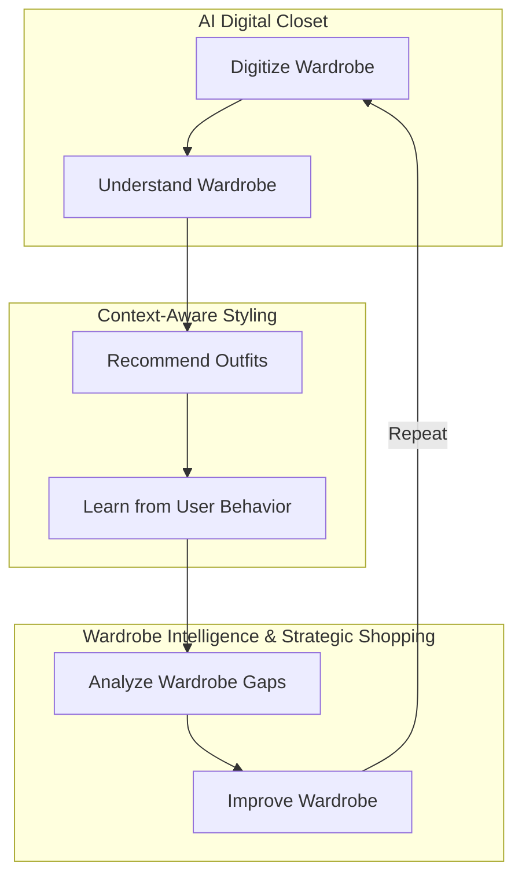
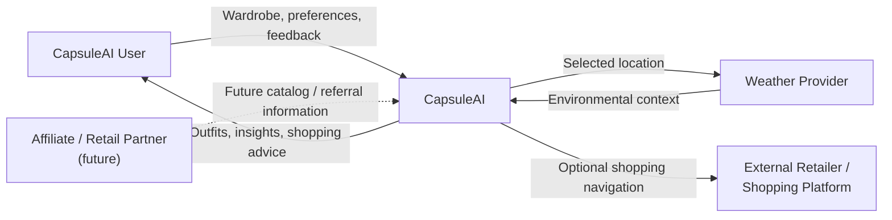
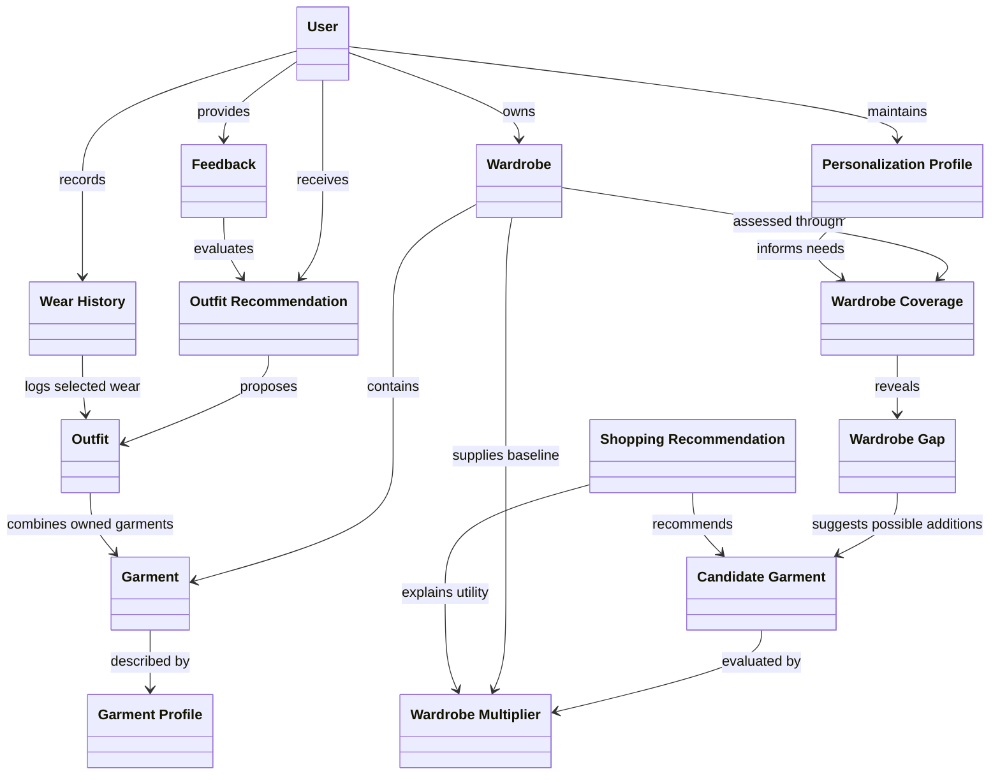
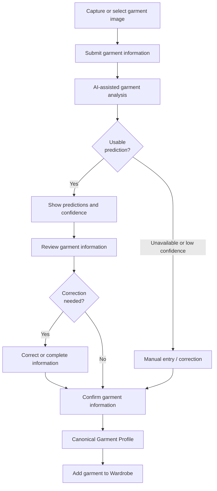
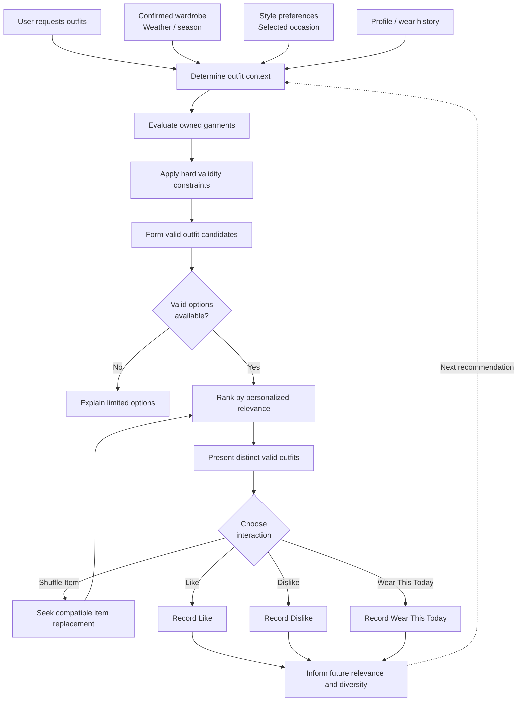
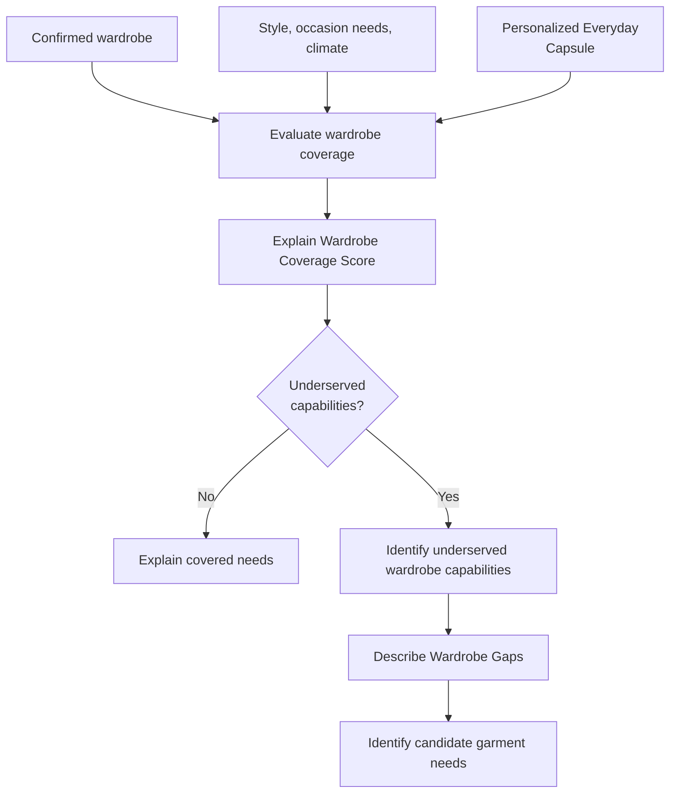
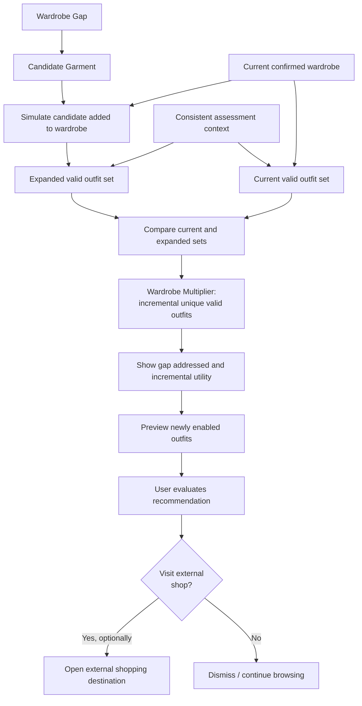

# CapsuleAI — Business Requirements Document

## 1. Document Control

| Field | Value |
|---|---|
| Document Name | CapsuleAI — Business Requirements Document |
| Product | CapsuleAI |
| Version | 0.3 |
| Status | Baseline Draft |
| Last Updated | 2026-10-05 |
| Primary Owner / Role | Business Analyst / Product; accountable to the Product Owner |
| Approval Authority | Product Owner / Product Decision Authority |
| Reviewers / Stakeholders | Founding / Product Team, end-user representatives, UX/Product Design, Tech Lead, AI/ML Engineering, QA/Testing |
| Development Model | Scrum / Agile; artifacts maintained in the repository |
| Authoritative Location | `docs/01-business/BRD.md` |

### 1.1 Purpose and Authority

This BRD establishes the business intent, users, value, capabilities, and initial scope of CapsuleAI. It is the business source of truth for downstream product and requirements work once accepted. The approved decisions in the BRD creation request established the v0.1 business baseline. The v0.2 revision added business visualizations; this v0.3 revision resolves the capsule-needs and interface-language decisions and clarifies user-reported wear activity. Core positioning, scope, and stable business IDs are preserved; the draft status records that document review and acceptance have not yet occurred.

The [Scrum development workflow](../../Initial%20files/CapsuleAI_Scrum_Development_Workflow.md), especially Sections 6, 39–41, 46, and 49, governs artifact ownership, order, traceability, and change propagation. Product behavior belongs in the PRD; testable software requirements in the SRS; domain invariants in Business Rules; architecture drivers and design in ASR/ADD. This BRD does not replace those artifacts.

### 1.2 Source Documents and Reconciliation

| ID | Source | Business Use / Authority |
|---|---|---|
| SRC-01 | [CapsuleAI Scrum Development Workflow](../../Initial%20files/CapsuleAI_Scrum_Development_Workflow.md) | Process authority; artifact boundaries, ownership, and traceability. |
| SRC-02 | User-approved BRD creation request, October 5, 2026 | Highest authority for the business decisions consolidated in this document and its Baseline Decision Summary. |
| SRC-03 | [Existing Product Requirements Document](../../Product%20Requirements%20Document_%20CapsuleAI.md) | Detailed product context and existing journeys, subject to SRC-02 and later explicit project decisions. |
| SRC-04 | [CapsuleAI Implementation Summary](../../Initial%20files/CapsuleAI_Implementation_Summary.md) | Consolidated source context; Section 15 contains explicit later decisions. Suggested mappings and priority interpretations are not additional business commitments. |
| SRC-05 | [DA 2 Proposal](../../Initial%20files/DA%202%20Proposal.md) | Earlier problem, persona, and value-proposition material. |
| SRC-06 | [Official Project Outline](../../Initial%20files/%C4%90%E1%BB%80%20C%C6%AF%C6%A0NG%20%C4%90%E1%BB%92%20%C3%81N%202_%20H%E1%BB%86%20TH%E1%BB%90NG%20QU%E1%BA%A2N%20L%C3%9D%20V%C3%80%20G%E1%BB%A2I%20%C3%9D%20PH%E1%BB%90I%20%C4%90%E1%BB%92%20TH%C3%94NG%20MINH.md) | Earlier account, wardrobe, contextual styling, and gap-analysis context. |
| SRC-07 | [Business Analysis notes](../../Business%20Analysis.docx) | Exploratory commercial and marketing notes; not approved MVP scope. |
| SRC-08 | [Food Delivery BRD reference](../../docs%20tham%20kh%E1%BA%A3o/BRD_FoodDelivery.md) | Documentation-quality reference for context, conceptual objects, and business processes; no CapsuleAI domain authority. |
| SRC-09 | User-approved BRD visual enhancement request, October 5, 2026 | Mermaid presentation policy and visual revision scope; preserves approved business decisions. |
| SRC-10 | User-approved product-decision synchronization request, October 5, 2026 | Resolves the personalized everyday capsule-needs approach, Vietnamese initial UI, and multiple user-reported wear events. Detailed product decisions are maintained in the [normalized PRD](../02-product/PRD.md). |

The repository provides Markdown versions of the proposal, outline, and PRD referenced by DOCX name in earlier documents. These versions and the available Business Analysis DOCX were reviewed. The README identifies the product only; no separate architecture reference documents were present. SRC-08 was reviewed for visual organization and supporting explanations only; its domain requirements are not transferred to CapsuleAI.

Conflicts are resolved in this order: SRC-02 and the later approved business clarifications in SRC-10; other later explicit CapsuleAI decisions; the most detailed internally consistent product specification; earlier proposals. The Baseline Decision Summary records the resulting decisions. In particular, active behavioral personalization, the richer garment profile, inclusive optional profile fields, and the contextual Wardrobe Coverage Score supersede narrower earlier descriptions. The 90% recognition and 3–5 second processing targets also match SRC-04 Sections 15.2–15.3. Earlier growth projections and exploratory marketing ideas are not baseline commitments. Legacy competitor observations are not treated as verified current market evidence.

Stable IDs in this BRD identify business intent. Subsequent artifacts must reference them rather than recreate competing business baselines. Accepted changes retain IDs and propagate to affected artifacts through repository review.

### 1.3 Revision History

| Version | Date | Revision |
|---|---|---|
| 0.1 | 2026-10-05 | Initial business baseline draft. |
| 0.2 | 2026-10-05 | Added business value loop, system context, conceptual domain model, and business process diagrams; no intentional change to approved business scope or stable IDs. |
| 0.3 | 2026-10-05 | Resolved capsule-needs and initial-interface-language business questions and synchronized wear-history semantics; no change to core product positioning, scope, or stable IDs. |

### 1.4 Business Visualization Policy

Embedded Mermaid diagrams explain business context, concepts, and processes. They supplement the business goals, requirements, and capabilities; they do not introduce additional requirements. Formal UML use-case, activity, sequence, state, deployment, and architecture artifacts remain separate and follow the notation rules in SRC-01.

SRC-02 and SRC-10 govern the business decisions and subsequent clarifications; SRC-09 governs the business visualization policy. Mermaid business process visualizations in this BRD do not replace later formal requirements or design diagrams.

## 2. Executive Summary

CapsuleAI is a personalized wardrobe-intelligence and decision-support platform that helps people digitize clothing they own, choose context-appropriate outfits, understand wardrobe utilization, and evaluate purchases by the additional utility they create.

The initial product connects three pillars: **AI Digital Closet**, **Context-Aware Styling**, and **Wardrobe Intelligence & Strategic Shopping**. AI assists garment understanding; the user confirms or corrects the result. Recommendations combine validity constraints with personalized ranking and meaningful feedback. Coverage and gap analysis then identify needs, while the **Wardrobe Multiplier** estimates the number of additional valid outfits a candidate garment enables.

The MVP is mobile-first for Android and iOS, with initial validation among smartphone users in Vietnam and room for later regional expansion. It supports a complete wardrobe-to-decision-to-improvement experience. Shopping takes place through optional external links. Native commerce and sophisticated learned ranking are not prerequisites for delivering core value.

CapsuleAI is a real product at the initial MVP stage. Its current university-project delivery context does not reduce its business model to an academic demonstration. This baseline makes no claim of existing production adoption, revenue, partnerships, or validated market traction.

## 3. Business Context

CapsuleAI addresses a disconnect between owning clothing and knowing how to use it. Physical wardrobes offer limited visibility into combinations, suitability for a particular day, and items that receive little use. Users may repeatedly select familiar outfits while other garments remain overlooked.

Digitization can improve visibility, but photographing, cleaning images, and describing every garment creates initial effort before useful advice becomes available. A wardrobe record alone also leaves the user to decide how items work together. Shopping recommendations require a further connection: whether a proposed item addresses the individual's needs and complements existing clothing.

The opportunity is to support reuse and better purchasing decisions through one connected experience. Greater utility from owned clothing and fewer low-value purchases may support less waste; environmental savings are not quantified or guaranteed.

These problems and opportunities are hypotheses derived from CapsuleAI source documents. Their prevalence, severity, and commercial demand require product validation; no market-size estimate or fabricated research result is asserted.

## 4. Problem Statement

| ID | User Problem | Business Consequence | Related Goals |
|---|---|---|---|
| PB-01 | Digitizing garments requires too much photography cleanup and attribute entry. | Users may abandon setup before the wardrobe becomes useful. | BG-01 |
| PB-02 | Choosing an outfit requires reconciling clothing, weather, occasion, and personal preferences each day. | Decision effort persists despite owning suitable clothing. | BG-02 |
| PB-03 | Users lack visibility into overlooked garments and alternative combinations. | Wardrobe value is concentrated in a small set of familiar outfits. | BG-03 |
| PB-04 | Purchases are evaluated without sufficient evidence of compatibility with owned garments. | New items may add clutter and little practical utility. | BG-04 |
| PB-05 | Users cannot readily explain which clothing needs are underserved or how to address them. | Gap recommendations may feel arbitrary or sales-driven. | BG-03, BG-04 |

## 5. Product Vision

> Enable people to make confident daily clothing and purchasing decisions by turning their own wardrobe into understandable, personalized, and actionable intelligence.

The longer-term direction is a trusted wardrobe companion that improves as users refine garment information and express preferences. CapsuleAI should support broader garment types, deeper personalization, and additional markets over time, while keeping user authority, explainability, and wardrobe utility central.

## 6. Value Proposition

**Digitize Wardrobe → Understand Wardrobe → Recommend Outfits → Learn from User Behavior → Analyze Wardrobe Gaps → Improve Wardrobe**

| Pillar | Value Delivered | Connection to the Value Loop |
|---|---|---|
| AI Digital Closet | Reduce entry effort and create a reliable wardrobe representation through assisted understanding and user confirmation. | Confirmed garment intelligence provides the foundation for styling and analysis. |
| Context-Aware Styling | Reduce daily decision effort and reveal useful combinations of owned garments. | Context and feedback make subsequent advice more relevant and expose utilization patterns. |
| Wardrobe Intelligence & Strategic Shopping | Explain unmet clothing needs and assess candidate purchases by incremental outfit utility. | Coverage, gaps, and simulated expansion support deliberate wardrobe improvement. |

The differentiation is the connection between reliable garment data, daily recommendations, behavioral feedback, and marginal purchase utility. A recommendation is evaluated against the user's wardrobe and needs rather than presented as a generic product promotion. Wardrobe improvement can result from rediscovering existing clothing; a purchase is optional.

### 6.1 Business Value Loop

The diagram groups the recurring value loop under the three approved product pillars. It shows how trustworthy garment information, daily decisions, and wardrobe improvement reinforce one another.

Wardrobe improvement includes better use of existing garments as well as optional additions; the loop does not require a purchase. This view connects BG-01–BG-04 and CAP-02–CAP-10; the requirements register defines the commitments behind each stage.

## 7. Business Goals

| ID | Goal | Rationale | Expected Business / User Value | Related Product Capabilities |
|---|---|---|---|---|
| BG-01 | Reduce Wardrobe Digitization Effort | Manual setup delays access to useful wardrobe advice. | Faster access to a trustworthy digital closet with less repetitive entry. | CAP-01–CAP-04 |
| BG-02 | Reduce Outfit Decision Effort | Appropriate selection involves several competing contextual factors. | Quicker, more confident outfit decisions using owned garments. | CAP-01, CAP-03–CAP-06 |
| BG-03 | Increase Wardrobe Utilization | Familiar combinations can leave suitable garments overlooked. | More useful combinations, better visibility into use, and greater value from existing clothing. | CAP-03–CAP-08 |
| BG-04 | Improve Purchase Quality | Compatibility and unmet needs are difficult to evaluate before buying. | Better evidence for purchases that expand versatility; fewer low-utility additions. | CAP-01, CAP-04, CAP-05, CAP-07–CAP-10 |

## 8. Stakeholders

Influence describes the role's expected contribution to product decisions, not a claim that named people or partner organizations have been appointed. A small team may combine several roles.

| Group | Stakeholder | Interest | Responsibilities / Expectations | Influence | Primary Concerns |
|---|---|---|---|---|---|
| Decision | Product Owner / Product Decision Authority | Coherent product value and scope. | Accept business baseline; resolve business questions; prioritize outcomes and approve changes. | High — decision authority | Value, scope, evidence, and trade-offs. |
| Decision | Founding / Product Team | A useful, evolvable product and sustainable commercial direction. | Shape strategy, validate assumptions, and assess opportunities. | High | Product coherence, adoption barriers, and viable operating effort. |
| End users | Users representing the three behavioral personas | Easier wardrobe, outfit, and purchase decisions. | Confirm their data, control preferences, and provide validation feedback. | High — value validation | Effort, relevance, privacy, trust, and control. |
| Delivery | Software Development Team / Tech Lead | Feasible and reliable delivery. | Review feasibility and translate accepted intent into downstream artifacts and increments. | Medium to high | Clarity, maintainability, reliability, and scope. |
| Delivery | UX / Product Design | An understandable and inclusive experience. | Reduce setup friction and communicate recommendations, uncertainty, and user choices. | Medium | Usability, explanation, and accessibility. |
| Delivery | AI / ML Engineering | Useful, confidence-aware garment understanding and personalization. | Evaluate prediction quality and communicate limitations and improvement opportunities. | Medium | Data quality, correction, and realistic AI claims. |
| Delivery | QA / Testing | Evidence that product outcomes and trust commitments hold. | Validate targets, failure paths, and business traceability. | Medium | Measurability, recommendation validity, and privacy. |
| Project governance | University instructors / reviewers | Delivery quality and project assessment. | Review project outcomes within the current delivery setting. | Medium — project governance | Evidence and professional practice; not the business customer. |
| Future commercial | Retailer / affiliate partners | Relevant referrals and accurate product information. | Potentially supply catalog information, destinations, and attribution under future agreements. | Conditional — no established partnership assumed | Data freshness, referral quality, and transparent commercial terms. |

Weather providers, image-processing services, storage services, and app stores are external dependencies, not personas or business customers.

## 9. System Context

### 9.1 Business System Context Diagram

This view places CapsuleAI between the user and the external business information or shopping destinations that support its value proposition. CapsuleAI is shown as one business system so readers can understand its boundary without inferring an internal architecture.

The user supplies and confirms personal wardrobe information and remains the decision maker. External navigation leaves CapsuleAI's business boundary; the retailer handles purchasing independently. The dashed partner relationship is a future possibility, not an established integration or MVP dependency. This context supports BR-007, BR-013, BR-018–BR-019, BR-021, and BR-024.

### 9.2 External System Descriptions

| External Actor/System | Business Purpose | Information Exchanged | Business Dependency |
|---|---|---|---|
| CapsuleAI User | Obtain wardrobe, outfit, and purchase decision support. | Garment information, confirmations/corrections, preferences, occasion, and feedback; receives recommendations and wardrobe insights. | User participation and sufficiently reliable wardrobe information underpin the value loop. |
| Weather Provider | Supply environmental context for appropriate advice. | Selected location/city context and relevant weather information. | Weather relevance depends on availability and freshness; device location permission remains optional (DEP-003). |
| External Retailer / Shopping Platform | Provide an optional destination for evaluating and purchasing a recommended item. | Outbound navigation to an external purchasing page; no transaction processing in CapsuleAI. | Usable destinations support shopping advice, while core wardrobe value remains independent (DEP-005, CON-003). |
| Future Affiliate / Retail Partner | Potentially improve catalog information and referral evidence under later agreements. | Possible candidate information and referral/attribution information, subject to approved commercial and privacy terms. | Future only; no existing contract, automatic personal-data sharing, or integration obligation is assumed. |

## 10. Target Market

The initial validation focus is **smartphone users in Vietnam** whose behavior aligns with the personas in Section 11. Recruitment and product evaluation should investigate daily wardrobe decisions, garment reuse, and purchase evaluation rather than impose demographic stereotypes.

CapsuleAI is **mobile-first**, targeting **Android and iOS**. A consumer web or desktop application is not required for the initial baseline. No device-version threshold or implementation framework is established by this BRD.

The business approach is **Vietnam-first, expansion-ready**. Clothing needs, climate, occasions, units, currencies, language, and shopping destinations may vary by region. Product concepts should permit later localization and geographic expansion without making Vietnamese location, a single climate model, or one retailer essential to the domain. The initial Vietnam MVP interface is Vietnamese; project documentation remains English. English and additional interface languages may be added later without redefining the business/domain model. Multi-language UI is not an MVP obligation.

## 11. User Personas

These are behavioral archetypes. One person may exhibit characteristics of more than one persona; they are not fixed demographic segments.

| Persona / Priority | Context | Goals | Pain Points | Desired Outcomes | Relevant Capabilities |
|---|---|---|---|---|---|
| **The Indecisive Professional — Primary** | A busy individual selecting clothing under time pressure and changing weather or occasion needs. | Choose an appropriate outfit quickly and confidently. | Repetitive decisions, familiar-outfit dependence, and uncertainty about suitability. | Several understandable options, quick item substitution, and advice that improves with feedback. | CAP-01–CAP-06 |
| **The Fashion-Conscious Minimalist — Secondary** | A user seeking a versatile capsule wardrobe with less clutter. | Gain more use from fewer useful garments and understand coverage. | Overlooked clothing, repeated combinations, and unclear unmet needs. | Visibility into utilization, diverse combinations, and explainable coverage and gaps. | CAP-03–CAP-09 |
| **The Smart Shopper — Secondary** | A user evaluating whether a potential purchase complements the current wardrobe. | Identify additions that create practical value before spending. | Attractive items with limited pairing potential and generic shopping suggestions. | Gap-based advice, incremental outfit counts, previews, and optional external destinations. | CAP-04, CAP-07–CAP-10 |

## 12. Business Domain Model

### 12.1 Conceptual Business Domain Diagram

The model names the business concepts that connect a user's wardrobe, outfit decisions, and purchase evaluation. Relationships express business meaning rather than software dependencies, database structure, or implementation classes.

A Garment is an owned wardrobe item; a Candidate Garment is a possible addition evaluated hypothetically. Wardrobe Gaps express underserved needs, and a Shopping Recommendation offers one possible response. Garment Profile means the user-confirmed representation, while Wear History records user-reported wear events. Multiple events can occur within a day; they do not prove observed physical wear. The diagram omits attributes, methods, and physical cardinalities; the descriptions below retain the business meaning needed for CAP-01–CAP-10 and BR-002, BR-006–BR-017.

### 12.2 Business Object Descriptions

| Business Object | Business Meaning | Key Relationships |
|---|---|---|
| User | A person receiving CapsuleAI advice and controlling their wardrobe information and preferences. | Owns a Wardrobe, maintains a Personalization Profile, receives recommendations, provides Feedback, and records Wear History. |
| Personalization Profile | Declared preferences and optional personal context used to make advice relevant. | Belongs to the User and informs styling and the needs assessed through Wardrobe Coverage; it does not impose gender/body restrictions. |
| Wardrobe | The user's current digital representation of clothing they own. | Contains Garments and provides the baseline for outfit advice, coverage, gaps, and candidate utility. |
| Garment | An owned clothing item within the initial categories. | Belongs to a Wardrobe, has a Garment Profile, and participates in Outfits. |
| Garment Profile | The authoritative user-confirmed description of a garment, supported by confidence-aware AI predictions or manual entry. | Describes a Garment and supports compatibility, context, coverage, and utilization understanding. |
| Outfit | A meaningful combination of clothing assessed for compatibility and context. | Daily outfits combine owned Garments; hypothetical previews may also include a Candidate Garment. |
| Outfit Recommendation | Advice proposing a valid outfit for the user's current context, ordered by personalized relevance. | Proposes an Outfit to a User and can receive Feedback or a recorded wear selection. |
| Feedback | Explicit Like/Dislike assessments and meaningful behavioral signals used to improve advice. | Comes from the User, relates to recommended outfits, and informs future personalized ranking. |
| Wear History | The record of user-reported wear activity, including multiple wear events within a day; it is not automatic verification of physical wear. | Connects the User to reported Outfits and associated garment use and informs utilization, preference, diversity, and recency. |
| Wardrobe Coverage | The contextual assessment of how well the wardrobe meets the user's clothing needs, expressed through an explainable Wardrobe Coverage Score. | Evaluates the Wardrobe using relevant needs and context and may reveal Wardrobe Gaps. |
| Wardrobe Gap | An underserved clothing capability rather than an obligation to buy a particular product. | Arises from coverage analysis and leads to possible Candidate Garments. |
| Candidate Garment | A hypothetical addition with attributes relevant to a wardrobe gap. | Can address a Wardrobe Gap, be evaluated through Wardrobe Multiplier, and appear in a Shopping Recommendation or preview. |
| Wardrobe Multiplier | The incremental number of unique valid outfits enabled by adding a particular candidate to the current wardrobe under a consistent context. | Connects Candidate Garment evaluation to the Wardrobe baseline and provides evidence for a Shopping Recommendation. |
| Shopping Recommendation | Explainable advice about a potentially useful addition, with utility evidence and an optional external destination. | Relates a Candidate Garment to a gap, Wardrobe Multiplier, and hypothetical Outfit previews for the User to assess. |

## 13. Core Business Capabilities

### 13.1 Capability Map

| ID | Capability | Business Purpose |
|---|---|---|
| CAP-01 | Account & Personalization | Maintain a private personal wardrobe context, style preferences, and optional profile information. |
| CAP-02 | AI Digital Closet | Convert captured or selected garment images into usable wardrobe entries with less manual effort. |
| CAP-03 | Wardrobe Management | Keep the wardrobe current and discoverable through maintenance, browsing, search, and filtering. |
| CAP-04 | Garment Intelligence | Describe garment characteristics sufficiently to support styling, coverage, and purchase evaluation. |
| CAP-05 | Context-Aware Styling | Offer valid, personally relevant outfits and compatible item alternatives from owned clothing. |
| CAP-06 | Behavioral Personalization | Use explicit feedback and recorded wear choices to improve relevance and diversity. |
| CAP-07 | Wardrobe Analytics | Explain garment utilization and contextual Wardrobe Coverage Score. |
| CAP-08 | Gap Analysis | Identify underserved clothing needs rather than missing items on a universal checklist. |
| CAP-09 | Wardrobe Multiplier | Estimate the additional valid outfits enabled by a candidate garment. |
| CAP-10 | Strategic Shopping | Present utility-based recommendations, hypothetical previews, optional external links, and interaction evidence. |

### 13.2 Garment Intelligence and User Authority

The official direction is a rich structured garment profile. The following terms describe business information needs, not a prescribed data schema.

| Dimension | Required Concepts | Business Significance |
|---|---|---|
| Classification | `primaryCategory`, `subType` | Understand garment role and useful distinctions within the four initial categories. |
| Layering & Shape | `layeringLevel`, `bulkIndex`, `fit`, `silhouette` | Assess compatible layering and outfit shape. |
| Color Profile | `dominantColor`, `secondaryColors`, `HEX`, `HSL`, `colorTemperature`, `paletteRole` | Represent color beyond a single label and support explainable harmony. |
| Pattern Profile | `patternType`, `patternDensity`, `visualNoise` | Distinguish pattern character and visual conflicts. |
| Contextual Attributes | `seasonSuitability`, `occasionTags`, `styleTags` | Relate clothing to environmental and personal needs. |
| Material | `material`, `materialConfidence` | Support contextual understanding while making uncertainty visible and correctable. |

**AI Prediction → User Review → User Confirmation / Correction → Canonical Garment Profile**

The final user-confirmed profile is the authoritative wardrobe representation. Attribute provenance must conceptually distinguish AI prediction, user confirmation, user correction, and user entry; confidence and prediction source remain meaningful. Material predictions may be uncertain. Supporting these concepts does not imply equally reliable automatic recognition for every attribute. User correction data offers a future improvement opportunity subject to privacy commitments.

Exact taxonomies, scales, inference methods, and storage structures belong in later artifacts.

### 13.3 Recommendation and Feedback Meaning

Hard deterministic constraints eliminate invalid outfits, including incompatible required slots, layering, weather/season suitability, physically invalid combinations, and strong pattern conflicts. Soft personalized scoring ranks valid alternatives using color harmony, style, occasion, wear history, explicit feedback, recency, diversity, and optional body-profile preferences where applicable.

Style and occasion actively inform the initial recommendations. **Wear This Today** is a strong positive behavioral signal; **Like** is explicit positive feedback; **Dislike** is explicit negative feedback. Wear history can support long-term preferences, utilization, diversity, and short-term recency considerations. These signals influence the product experience in the MVP rather than only appear in a history display. Wear This Today records distinct user-reported wear events; multiple events may occur within a day, including separate intentional uses of the same outfit. Wear history supports utilization and lightweight personalization, while accidental or artificial repetition must not disproportionately distort advice. Recorded wear is not automatic proof of physical wear.

Body shape and gender are optional, editable context. Body shape may contribute softly; neither field creates discriminatory eligibility restrictions. Actual wardrobe contents and stated preferences take precedence. Location supports environmental context; permission is optional and manual city/location selection remains available.

The hybrid approach can initially use explicit rules and lightweight scoring. Advanced learned ranking is a future opportunity; formulas, weights, and fashion thresholds are deferred.

### 13.4 Coverage, Gaps, and Incremental Utility

**Wardrobe Coverage Score** estimates how well the current wardrobe serves the **Personalized Everyday Capsule**, one personalized capsule-needs model informed by common occasion priorities, style preferences, climate/environmental context, and confirmed wardrobe contents. Users' relevant needs can differ, so the same wardrobe can receive different contextual assessments. Coverage explains covered and underserved needs without a universal mandatory wardrobe checklist or an objective-completeness claim. Exact weighting and calculation rules remain downstream.

**Wardrobe Profile → Coverage Analysis → Missing Wardrobe Capability → Candidate Garments → Simulated Outfit Expansion → Wardrobe Multiplier → Strategic Recommendation**

**Wardrobe Multiplier** measures the incremental number of valid outfit combinations enabled by adding a candidate garment to the current wardrobe. Conceptually, with wardrobe `W`, candidate `c`, and valid outfit set `O(W)`:

- `NewOutfits(c) = O(W ∪ {c}) − O(W)`
- `WardrobeMultiplier(c) = |NewOutfits(c)|`

An illustrative wardrobe with 41 valid outfits that supports 58 after adding white sneakers has a Wardrobe Multiplier of **+17 New Outfits**. This is an example, not observed product performance.

Valid outfits are meaningful combinations assessed against slot and layering compatibility, season/weather, color harmony, pattern/noise, occasion, style, and an applicable compatibility threshold. Reordering the same garment identities does not create another outfit. Current and expanded wardrobes must be compared under a consistent assessment context; candidate previews remain hypothetical until the user adds an owned garment. The multiplier is a count of additional possibilities, not a guarantee of wear, fit, durability, savings, or purchase satisfaction. Calculation rules belong in Business Rules and later requirements/design artifacts.

## 14. Business Process Flows

These business visualizations explain how the approved capabilities create value across the user journey. They show decisions and outcomes at BRD level; detailed rules, acceptance criteria, and formal activity specifications remain downstream.

### 14.1 Garment Digitization and Wardrobe Ingestion

This process explains how a physical garment becomes a trustworthy digital wardrobe entry. Both AI-assisted review and manual fallback lead to user confirmation before information becomes authoritative.

AI results are proposals, not final business truth. Low confidence or unavailable analysis must not block manual creation; the canonical profile reflects the user's confirmation. This process primarily supports BG-01, BR-001–BR-005, and CAP-02–CAP-04.

### 14.2 Daily Outfit Recommendation

This process separates eliminating invalid combinations from ranking valid alternatives for the individual. It also shows how item substitution and explicit wear/feedback choices contribute to the ongoing experience.

Personalized ranking cannot make an invalid outfit eligible. Shuffle Item preserves the other selections and requires a compatible replacement; if none exists, explain the limitation and retain the current choice. Present at least three distinct valid options when the wardrobe permits, and explain limited choice otherwise. Wear This Today, Like, and Dislike meaningfully influence subsequent advice; no interaction is compulsory. This process supports BG-02–BG-03, BR-006–BR-013, and CAP-05–CAP-06.

### 14.3 Wardrobe Coverage and Gap Analysis

This process relates confirmed inventory to clothing needs before identifying potential additions. It makes the Wardrobe Coverage Score and the meaning of a gap understandable without assuming a universally complete wardrobe.

A gap is an underserved capability, such as versatile neutral casual footwear; white sneakers might be one candidate response. The example is illustrative and is not a universal requirement. Assessment depends on sufficiently confirmed information and the Personalized Everyday Capsule approach (resolved OBQ-001); insufficient information must not be presented as a proven need to purchase. This process supports BG-03–BG-04, BR-014–BR-015, and CAP-07–CAP-08.

### 14.4 Strategic Shopping and Wardrobe Multiplier

This process explains how an identified need becomes an evidence-based candidate recommendation. It compares the current wardrobe with a hypothetical addition to communicate incremental utility before the user considers an external destination.

Wardrobe Multiplier counts newly enabled unique valid outfits; it is neither a count of arbitrary combinations nor a forecast of actual wear or sales. Both sets use the same assessment context and garment-identity uniqueness principle defined in Section 13.4. Simulation does not add an owned garment, and following a link does not imply purchase confirmation or automatic wardrobe ingestion. Shopping occurs outside CapsuleAI. This process supports BG-04, BR-015–BR-020, BR-024, and CAP-08–CAP-10.

## 15. High-Level Business Requirements

**Must** identifies an initial baseline commitment. **Should** identifies supporting value that depends on credible information; it does not downgrade any core capability. These requirements express business needs rather than software interfaces or detailed acceptance criteria.

### 15.1 Wardrobe Digitization and Management

| ID | Requirement | Business Rationale | Priority | Related Goals |
|---|---|---|---|---|
| BR-001 | Users must be able to create a digital representation of owned clothing with minimal manual effort through AI-assisted garment understanding. | Reduce setup friction and time to value. | Must | BG-01 |
| BR-002 | Users must retain final authority over garment information through review, confirmation, correction, and manual entry, with prediction confidence and provenance distinguished conceptually. | Reliable advice depends on trusted wardrobe information. | Must | BG-01, BG-02, BG-03, BG-04 |
| BR-003 | Wardrobe understanding must support the full garment-intelligence direction in Section 13.2, including uncertain, user-correctable material information. | Styling and utility assessment need richer context than basic tags. | Must | BG-01, BG-02, BG-03, BG-04 |
| BR-004 | AI prediction failure or uncertainty must not prevent users from creating and maintaining wardrobe entries manually. | Preserve value when automation is unavailable or inaccurate. | Must | BG-01 |
| BR-005 | Users must be able to maintain, browse, search, and filter an accurate current wardrobe, including adding, changing, and removing garments. | Decisions must reflect accessible, current possessions. | Must | BG-01, BG-02, BG-03 |
| BR-006 | Users must be able to understand recorded garment use and discover overlooked clothing and combinations. | Encourage greater value from items already owned. | Must | BG-03 |

### 15.2 Outfit Decision Support and Personalization

| ID | Requirement | Business Rationale | Priority | Related Goals |
|---|---|---|---|---|
| BR-007 | Daily outfit advice must use owned garments and consider weather/season, style, occasion, color, pattern, and layering suitability. | Reduce decision effort through relevant advice. | Must | BG-02, BG-03 |
| BR-008 | Users must receive several distinct valid options, targeting at least three when compatible wardrobe data permits, and be able to replace an individual item while retaining other choices. | Provide practical choice and control without starting over. | Must | BG-02, BG-03 |
| BR-009 | Recommendations must distinguish invalid combinations from the personalized ranking of valid outfits. | Prevent attractive scores from overriding incompatibility and support consistent utility assessment. | Must | BG-02, BG-03, BG-04 |
| BR-010 | Declared style preferences and selected occasion must actively influence initial advice and relevant wardrobe analysis. | Serve the user's actual clothing needs. | Must | BG-02, BG-03, BG-04 |
| BR-011 | Wear This Today, Like, Dislike, and wear history must have meaningful effects on lightweight personalization, utilization understanding, and recommendation variety. | Adapt advice to expressed preferences and reduce repetition. | Must | BG-02, BG-03 |
| BR-012 | Users must be able to omit or modify body-shape and gender information without restrictive garment eligibility rules. | Provide inclusive assistance and preserve individual choice. | Must | BG-02, BG-03, BG-04 |
| BR-013 | Users must be able to obtain location-based environmental context without granting device location permission, using manual location selection. | Support relevance without making location access a condition of participation. | Must | BG-02, BG-04 |

### 15.3 Wardrobe Intelligence and Strategic Shopping

| ID | Requirement | Business Rationale | Priority | Related Goals |
|---|---|---|---|---|
| BR-014 | Users must receive an explainable Wardrobe Coverage Score related to their style, common occasion needs, climate, and personalized everyday capsule-needs model. | Make underserved needs understandable without claiming universal completeness. | Must | BG-03, BG-04 |
| BR-015 | Gap analysis must identify missing wardrobe capabilities and connect them to candidate garments and estimated outfit expansion. | Make improvement advice specific to existing clothing and needs. | Must | BG-03, BG-04 |
| BR-016 | Candidate purchase utility must include Wardrobe Multiplier as the incremental count of unique valid outfits under a consistent assessment context. | Give users concrete evidence of additional versatility. | Must | BG-04 |
| BR-017 | Users must be able to inspect hypothetical newly enabled outfits before deciding whether a candidate addition is useful. | Make utility estimates understandable and assessable. | Must | BG-04 |
| BR-018 | Strategic shopping advice must explain the candidate and gap addressed, show estimated utility, and offer optional external purchasing destinations without requiring native commerce. | Support informed purchase decisions within the product boundary. | Must | BG-04 |
| BR-019 | The product must be able to evaluate recommendation views and external-link interactions in a privacy-respecting, affiliate-ready manner. | Understand recommendation usefulness and future referral opportunities. | Must | BG-04 |
| BR-020 | Recommendation information should include ideal attributes, price ranges, and durability/longevity guidance where credible supporting information exists, with estimates clearly qualified. | Improve evaluation without presenting unsupported claims as facts. | Should | BG-04 |

### 15.4 Privacy, Trust, and Evolution

| ID | Requirement | Business Rationale | Priority | Related Goals |
|---|---|---|---|---|
| BR-021 | Personal images, wardrobes, profile information, and behavior must remain private to authorized access, with understandable user control over their information. | Trust is necessary for participation across the value loop. | Must | BG-01, BG-02, BG-03, BG-04 |
| BR-022 | Users must be able to understand the basis and limitations of recommendations, coverage, and utility estimates, including insufficient data or unavailable context. | Enable informed choices and avoid false certainty. | Must | BG-02, BG-03, BG-04 |
| BR-023 | The initial product must serve Android and iOS users in Vietnam while preserving compatibility with future regions, garment categories, and personalization approaches. | Deliver a viable initial experience with room for continued development. | Must | BG-01, BG-02, BG-03, BG-04 |
| BR-024 | Core advice must prioritize wardrobe utility and remain useful independently of purchases, affiliate participation, or monetization. | Align commercial direction with user interests. | Must | BG-03, BG-04 |

## 16. Business Scope

### 16.1 In Scope

| Area | Initial Business Scope |
|---|---|
| Account & Personalization | Registration/login; personal profile; actively used style preferences and occasion; optional editable gender/body profile; location/weather context with manual location selection. |
| AI Digital Closet | Capture or select garment images; background removal; attribute extraction; confidence-aware predictions; user review/confirmation/correction; manual creation when AI is unavailable. |
| Wardrobe Management & Intelligence | Garment creation, viewing, updating, and deletion; browsing/search/filtering; the structured garment-intelligence direction in Section 13.2; recorded wear/utilization information. |
| Context-Aware Styling | Owned-wardrobe advice using weather, season, style, occasion, color, pattern, and layering; validity constraints and personalized ranking; several valid options when data permits. |
| Interaction & Learning | Shuffle Item; Wear This Today; Like/Dislike; outfit history; lightweight behavioral personalization with recency and diversity considerations. |
| Wardrobe Intelligence | Explainable Wardrobe Coverage Score; Gap Analysis; candidate staple evaluation; Wardrobe Multiplier; hypothetical outfit preview. |
| Strategic Shopping | Recommendation cards; gap and utility explanations; optional external shopping links; recommendation-view and external-link interaction tracking with future affiliate compatibility. |

The initial recommendation categories are **Top, Bottom, Outerwear, and Footwear**. Exact subtypes and context taxonomies are deferred. Support for the richer profile does not establish unsupported recognition targets for all attributes.

### 16.2 Out of Scope

- AR virtual try-on, 3D avatars or clothing simulation, and real-time video garment recognition.
- A complete social network/community.
- Native shopping carts, checkout, payment processing or gateways, order management, shipping/logistics, seller management, or a complete marketplace.
- One Piece, Accessories, Bags, and Headwear in the initial recommendation engine, including complex items such as jewelry, watches, scarves, and hair accessories.
- Consumer web and desktop applications as initial required platforms.
- Sophisticated learned ranking or advanced personalization models as MVP obligations.

Out of scope means excluded from this initial baseline, not permanently prohibited. Future inclusion requires an explicit product decision and traceable scope change; exploratory notes do not authorize expansion.

## 17. MVP Definition

The MVP is the minimum coherent experience that demonstrates all three pillars and the complete value loop:

1. Create an account and configure style and environmental context, with optional personal fields.
2. Capture or select garments, receive assisted image processing and attribute predictions, and confirm or correct the resulting profiles; use manual entry when needed.
3. Maintain enough compatible wardrobe information to obtain useful context-aware outfit alternatives.
4. Inspect outfits, Shuffle Item where alternatives exist, select Wear This Today, and provide Like/Dislike feedback.
5. See recorded use and experience lightweight personalization in subsequent advice.
6. Review explainable coverage and gaps based on the relevant capsule profile.
7. Inspect candidate additions, their Wardrobe Multiplier, and hypothetical newly enabled outfits.
8. Optionally follow an external purchasing link; wardrobe value remains available without shopping.

The MVP may use explicit validity rules, lightweight ranking, and a curated staple catalog; it does not require advanced ML or retailer integration. Insufficient wardrobe data must be explained rather than disguised through invalid or repeated recommendations. Completion means a coherent, usable mobile product experience, with the validation targets in Section 19 assessed under agreed conditions. A working increment may deliver part of this experience; it is not the complete MVP until the connected value proposition is available.

## 18. Business Model & Commercial Direction

CapsuleAI is **commerce-independent but affiliate-ready**. Digitization, daily styling, behavioral learning, and wardrobe understanding provide value regardless of whether a user buys anything or a commercial partner exists.

The initial shopping model is advisory: explain a candidate's utility, preview possible outfits, and optionally redirect to an external purchasing destination. The external merchant handles the transaction. Recommendation views and external-link interactions can provide product evidence and support later referral attribution; an outbound click is not evidence of a sale.

Affiliate arrangements, retailer partnerships, subscriptions, and premium insights are possible future revenue options, not established arrangements or MVP dependencies. No price plan, revenue forecast, or partnership commitment is approved here. Commercial incentives must preserve the utility-based product promise and transparent user choice.

## 19. Business Success Metrics

These are intended validation targets and measurement directions, not observed results. Recognition and response-time targets follow SRC-02 and explicit decisions in SRC-04. PRD/SRS and the test strategy must define qualified images, evaluation samples, reference workload, network/load conditions, timing boundaries, and reporting measures before formal acceptance. The recognition target does not apply indiscriminately to every garment attribute.

### 19.1 Product Quality / Validation

| ID | Metric | Purpose | Initial Target / Direction | Measurement Stage |
|---|---|---|---|---|
| MET-Q01 | Primary category and dominant-color recognition | Assess whether AI reduces meaningful entry effort. | Target at least 90% correctness for each attribute under qualified image conditions; background-removal usability evaluated separately. | Pre-MVP evaluation and pilot review |
| MET-Q02 | Garment-processing time | Preserve a low-effort digitization experience. | Target approximately 3–5 seconds under agreed reference conditions. | MVP integration validation |
| MET-Q03 | Outfit-generation time | Support timely daily decisions. | Target below approximately 3 seconds under an agreed reference workload, including a wardrobe of 100+ confirmed items. | MVP performance validation |
| MET-Q04 | Availability of distinct valid recommendations | Verify useful choice without fabricated variety. | At least three when sufficient compatible garments and valid combinations exist; explain limitations otherwise. | MVP recommendation validation |
| MET-Q05 | Manual continuity during AI failure | Ensure automation failure does not block wardrobe creation. | Manual creation remains available in all representative AI-failure validation scenarios. | MVP resilience validation |
| MET-Q06 | Cross-user privacy isolation | Protect personal wardrobe information. | Zero successful unauthorized cross-user wardrobe/image access in the agreed validation scenarios. | MVP trust validation |
| MET-Q07 | Utility and coverage explanation integrity | Verify defensible wardrobe intelligence. | Multiplier examples agree with unique valid additions; coverage explains assessed needs and context. | MVP domain validation |

### 19.2 Product Usage / Engagement

| ID | Metric | Purpose | Initial Target / Direction | Measurement Stage |
|---|---|---|---|---|
| MET-E01 | Confirmed garments added and time to a usable wardrobe | Understand setup friction and BG-01. | Establish a pilot baseline; improve completion and reduce effort without forcing a garment quota. | Initial user validation |
| MET-E02 | Outfit-generation use and reported time/effort to selection | Assess BG-02. | Establish baseline behavior and test whether the experience reduces decision effort. | Initial and repeat-use validation |
| MET-E03 | Wear This Today participation, wear-event activity, and Like/Dislike behavior | Assess relevance and feedback participation. | Distinguish reported wear-event activity from recommendation sessions with wear participation; account for multiple intentional events without accidental inflation and analyze explicit feedback separately. | Initial and repeat-use validation |
| MET-E04 | Recorded wardrobe utilization and outfit diversity | Assess BG-03. | Increase the share of owned garments represented in recorded wear and the variety of chosen combinations; account for incomplete logging. | Repeat-use validation |
| MET-E05 | AI correction rate | Find prediction and onboarding weaknesses. | Track by attribute and image conditions; reduce avoidable corrections while preserving user authority. | Evaluation and pilot review |
| MET-E06 | Gap and Wardrobe Multiplier engagement | Assess whether purchase evidence is useful. | Measure explanation/detail views and hypothetical-preview use; establish a baseline before setting numerical targets. | Initial user validation |
| MET-E07 | Repeat usage / cohort retention | Assess sustained value across the loop. | Establish cohort baselines and investigate return behavior; no unsupported growth target. | Post-MVP validation |

### 19.3 Commercial Evidence

| ID | Metric | Purpose | Initial Target / Direction | Measurement Stage |
|---|---|---|---|---|
| MET-C01 | External shopping-link click-through rate | Understand optional referral engagement. | Measure interactions relative to eligible linked recommendations; establish a baseline without equating clicks with purchases. | Initial shopping validation; later affiliate evaluation |
| MET-C02 | Verified referral contribution and operating economics | Evaluate an actual future commercial model. | Define targets only after a model and reliable attribution are approved; no initial revenue requirement. | Future commercial validation |

Quality and engagement findings guide refinement; commercial metrics do not override business goals or user trust.

## 20. Assumptions

The following are unvalidated assumptions, not confirmed market facts.

| ID | Assumption | Validation Direction |
|---|---|---|
| ASM-001 | Target users are willing to photograph a useful subset of their clothing and maintain a digital wardrobe. | Observe setup effort, completion, and reasons for abandonment. |
| ASM-002 | Users will review and correct uncertain predictions when the benefit and effort are clear. | Evaluate confirmation behavior, correction effort, and trust. |
| ASM-003 | Sufficient compatible inventory enables useful outfit variety. | Validate across different wardrobe sizes, category balance, and contexts. |
| ASM-004 | Weather and occasion context improve daily relevance. | Review perceived suitability across conditions and selected occasions. |
| ASM-005 | Explicit compatibility rules and lightweight personalized scoring can provide useful initial advice. | Evaluate relevance, repetition, and sensitivity to feedback without assuming fashion is objectively uniform. |
| ASM-006 | Explainable coverage and incremental outfit utility help users evaluate additions more deliberately. | Assess comprehension and decision usefulness; do not infer actual savings from counts alone. |
| ASM-007 | A curated staple catalog and usable external destinations can support initial strategic-shopping validation. | Check contextual relevance, information credibility, and link freshness without assuming retailer contracts. |

## 21. Business Constraints

| ID | Constraint | Business Implication |
|---|---|---|
| CON-001 | Initial delivery is mobile-first on Android and iOS, with Vietnam-first validation and a Vietnamese interface. | Prioritize the initial smartphone experience while retaining localization and expansion compatibility; multi-language UI is not required for MVP. |
| CON-002 | Initial recommendations cover Top, Bottom, Outerwear, and Footwear. | Validate within these categories; preserve room for later taxonomy growth. |
| CON-003 | Shopping occurs externally; native commerce is excluded. | Product value and MVP completion cannot depend on checkout or transaction fulfillment. |
| CON-004 | User-confirmed garment information takes precedence over uncertain predictions. | AI assists the wardrobe representation and does not remove user authority. |
| CON-005 | Body shape, gender, and device location permission are optional; personal information remains protected. | Participation and useful advice must not require intrusive or restrictive profiling. |
| CON-006 | The MVP must connect all three pillars while respecting Section 16 exclusions. | Avoid reducing the product to an outfit generator or expanding it into deferred capabilities. |

No unsupported launch deadline, staffing capacity, market-size estimate, or growth commitment is established by this baseline.

## 22. Dependencies

| ID | Dependency | Business Effect / Required Consideration |
|---|---|---|
| DEP-001 | Usable garment-image input | Image conditions affect prediction quality; guidance, correction, and manual entry preserve participation. |
| DEP-002 | Availability and quality of AI image processing | Automation benefit depends on usable results; manual wardrobe creation remains necessary. |
| DEP-003 | Weather information and user-selected location context | Environmental relevance depends on available, credible context; unavailable or stale weather must be communicated. |
| DEP-004 | Sufficient confirmed inventory and relevant Personalized Everyday Capsule needs/context | Outfit variety and coverage require meaningful wardrobe information and the user's common occasion priorities, style, and climate/context. |
| DEP-005 | Curated candidate information and usable external purchasing destinations | Shopping advice needs relevant candidates, qualified claims, and maintained links; core wardrobe advice remains independent. |
| DEP-006 | Mobile distribution and reliable handling of personal images/data | Android/iOS availability and user trust depend on operational readiness; vendors and infrastructure choices belong in later artifacts. |

## 23. Business Risks

Likelihoods are qualitative planning judgments for an unvalidated MVP, not measured probabilities.

| ID | Risk | Impact | Likelihood | Mitigation Direction |
|---|---|---|---|---|
| RSK-001 | AI attributes or background removal are inaccurate. | More corrections and reduced trust. | High | Qualified-input guidance, visible uncertainty, user confirmation, manual fallback, and targeted evaluation. |
| RSK-002 | Initial wardrobe setup feels burdensome. | Users leave before reaching useful advice. | High | Low-effort ingestion, clear value, progressive setup, and direct observation of friction. |
| RSK-003 | Wardrobes contain too few compatible garments. | Limited valid outfit choice and uncertain gap interpretation. | Medium | Explain limitations and distinguish insufficient information from a genuine missing capability. |
| RSK-004 | Users distrust outfit relevance. | Advice is ignored and feedback remains sparse. | Medium | Use actual preferences/context, understandable explanations, item substitution, and feedback-driven refinement. |
| RSK-005 | Simplified fashion rules suppress personally acceptable combinations. | Advice becomes rigid or unsuitable for some users. | Medium | Distinguish validity from preference, validate with users, and evolve rules without treating taste as universal truth. |
| RSK-006 | Body or gender personalization feels judgmental or restrictive. | Exclusion and loss of trust. | Medium | Optional editable fields, neutral language, soft influence, and precedence for stated preferences. |
| RSK-007 | Coverage or multiplier numbers are poorly explained. | Users misunderstand estimates or view them as arbitrary sales claims. | Medium | Show context, needs, uncertainty, and examples; validate comprehension and count integrity. |
| RSK-008 | Catalog information or external links become stale. | Purchase advice loses credibility or leads to unusable destinations. | Medium | Curate and review information; qualify estimates and remove or update unsuitable links. |
| RSK-009 | Privacy concerns discourage sharing images, profile, location, or behavior. | Reduced participation and damaged trust. | Medium | Private access, clear purpose, optional permissions, user control, and targeted privacy validation. |
| RSK-010 | Recommendations become repetitive. | Users gain little discovery value and stop returning. | Medium | Use wear history, explicit feedback, diversity, and recency while respecting validity. |

## 24. Ethical / User Trust Considerations

| Consideration | Business Commitment |
|---|---|
| Body-shape sensitivity | Offer optional, editable context; avoid prescriptive judgments and hard exclusions based on body profile. |
| Gender assumptions | Do not prohibit clothing on gender grounds; prioritize actual garments and explicitly expressed preferences. |
| Privacy and location | Explain why images, profile, and behavior are used; preserve authorized access and user control. Device location is optional, with manual selection available. |
| AI authority | Make uncertain predictions distinguishable; accept user confirmation, correction, and entry as authoritative wardrobe information. |
| Explainability | Explain outfit relevance, assessed wardrobe needs, and new-outfit potential in terms users can evaluate. A score must not imply objective taste or completeness. |
| Shopping integrity | Prioritize useful additions and existing-clothing reuse. Do not manufacture gaps, urgency, or guaranteed savings to stimulate purchases. Identify commercial relationships when applicable. |
| Personalization control | Let users revise declared preferences and optional fields and provide meaningful feedback. Do not present recorded selections as verified physical wear. |
| Improvement data | Treat potential reuse of corrections and behavior for future AI improvement as subject to clear privacy and user-control commitments, not automatic unrestricted permission. |

These are product trust commitments, not assertions of legal certification or regulatory compliance.

## 25. Future Opportunities

The following are possibilities for later evaluation, not additions to MVP scope or commitments to deliver.

| Opportunity | Potential Business Value | Boundary |
|---|---|---|
| Richer taxonomy, One Piece, Accessories, Bags, and Headwear | Support more complete clothing decisions. | Extend categories only after product and compatibility needs are validated. |
| Advanced ML ranking and personalization models | Improve relevance as sufficient trustworthy feedback becomes available. | No sophisticated learned model required initially. |
| Retailer integrations and affiliate partnerships | Improve candidate information, external destinations, and referral evidence. | No existing integration, contract, native commerce, or retailer dependency assumed. |
| Subscriptions / premium insights | Explore payment for sustained wardrobe intelligence. | Packaging, willingness to pay, and commercial terms require later validation. |
| Social / community experiences | Explore optional inspiration and sharing. | A complete community is excluded initially and needs a separate privacy/value assessment. |
| AR / virtual try-on | Explore additional purchase-confidence support. | AR, 3D avatars, and clothing simulation are deferred. |
| Additional markets and localization | Adapt the value loop to more climates, occasions, languages, and shopping contexts. | Expansion readiness does not require simultaneous multi-market launch. |

## 26. Traceability

The matrix connects business goals to the requirements that support them and the capabilities that deliver their value. BR IDs remain stable during PRD normalization. Downstream SRS, Business Rules, use cases, Scrum artifacts, architecture, implementation, and tests derive their own detail and retain links to the applicable business intent.

| Business Goal | Business Requirements | Product Capabilities |
|---|---|---|
| BG-01 — Reduce Wardrobe Digitization Effort | BR-001, BR-002, BR-003, BR-004, BR-005, BR-021, BR-023 | CAP-01 Account & Personalization; CAP-02 AI Digital Closet; CAP-03 Wardrobe Management; CAP-04 Garment Intelligence |
| BG-02 — Reduce Outfit Decision Effort | BR-002, BR-003, BR-005, BR-007, BR-008, BR-009, BR-010, BR-011, BR-012, BR-013, BR-021, BR-022, BR-023 | CAP-01 Account & Personalization; CAP-03 Wardrobe Management; CAP-04 Garment Intelligence; CAP-05 Context-Aware Styling; CAP-06 Behavioral Personalization |
| BG-03 — Increase Wardrobe Utilization | BR-002, BR-003, BR-005, BR-006, BR-007, BR-008, BR-009, BR-010, BR-011, BR-012, BR-014, BR-015, BR-021, BR-022, BR-023, BR-024 | CAP-03 Wardrobe Management; CAP-04 Garment Intelligence; CAP-05 Context-Aware Styling; CAP-06 Behavioral Personalization; CAP-07 Wardrobe Analytics; CAP-08 Gap Analysis |
| BG-04 — Improve Purchase Quality | BR-002, BR-003, BR-009, BR-010, BR-012, BR-013, BR-014, BR-015, BR-016, BR-017, BR-018, BR-019, BR-020, BR-021, BR-022, BR-023, BR-024 | CAP-01 Account & Personalization; CAP-04 Garment Intelligence; CAP-05 Context-Aware Styling; CAP-07 Wardrobe Analytics; CAP-08 Gap Analysis; CAP-09 Wardrobe Multiplier; CAP-10 Strategic Shopping |

## 27. Resolved Business Decisions

The business questions below are resolved by SRC-10. No new open business question was identified during synchronization; document review and acceptance remain separate from decision resolution.

| ID | Resolved Business Decision | Status | Business Effect |
|---|---|---|---|
| OBQ-001 | Use one Personalized Everyday Capsule approach informed by user needs/common occasion priorities, style, climate/context, and the current confirmed wardrobe. | Resolved | Coverage evaluates relevant individual needs rather than a universal mandatory wardrobe checklist; detailed product vocabularies and weighting remain in PRD/downstream artifacts. |
| OBQ-002 | Initial Vietnam MVP UI is Vietnamese; documentation remains English. English and additional UI languages may be introduced later. | Resolved | Establishes initial audience comprehension while preserving localization/expansion readiness; multi-language UI is not required for MVP. |

Product decisions OPQ-001–OPQ-010 are resolved in the [PRD's Resolved Product Decisions](../02-product/PRD.md#34-resolved-product-decisions). Exact scoring formulas, numerical confidence thresholds, performance-test conditions, and technical design remain downstream specification work rather than unresolved business positioning decisions.

## 28. Approval / Exit Criteria

BRD v0.3 is ready for acceptance and the next workflow step when the Product Owner, with relevant stakeholder review, confirms that:

- The user problems, product vision, three connected pillars, and expected value are clear.
- Decision stakeholders, end users, and supporting roles are identified.
- The three behavioral personas and Vietnam-first, Android/iOS market approach are agreed.
- BG-01–BG-04 and the business requirements are coherent and traceable to capabilities.
- Initial scope, exclusions, and the complete MVP experience are explicit.
- Garment confirmation authority, inclusive personalization, explainability, and commerce independence are preserved.
- Validation targets, assumptions, dependencies, constraints, and material risks are documented without presenting hypotheses as results.
- OBQ-001 and OBQ-002 are resolved, the approved business clarifications are synchronized with the PRD, and no unresolved business ambiguity blocks downstream refinement.

Acceptance is recorded through repository review and an appropriate document-status update by the decision authority. This draft does not claim completed approval. Later evidence may refine the baseline through controlled, traceable changes rather than freeze requirements before iterative development.

## BRD Baseline Decision Summary

| Topic | Approved Business Decision | Authority / Reference |
|---|---|---|
| Positioning | Real MVP-stage wardrobe-intelligence and decision-support product with commercial evolution potential. | SRC-02; Sections 2 and 5 |
| Value model | AI Digital Closet → Context-Aware Styling → Wardrobe Intelligence & Strategic Shopping, connected by user feedback. | SRC-02; Section 6 |
| Market and platform | Vietnam-first, expansion-ready; mobile-first on Android and iOS; Vietnamese initial UI with later localization possible. | SRC-02, SRC-10; Section 10 |
| Personas | Indecisive Professional is primary; Fashion-Conscious Minimalist and Smart Shopper are secondary behavioral archetypes. | SRC-02; Section 11 |
| Initial categories | Top, Bottom, Outerwear, Footwear; richer categories are deferred. | SRC-02; Section 16 |
| Garment intelligence | Rich classification, layering/shape, color, pattern, context, and confidence-aware material concepts. | SRC-02; Section 13.2 |
| Wardrobe authority | User-confirmed/corrected information is canonical; AI uncertainty and manual entry remain meaningful. | SRC-02; BR-002–BR-004 |
| Recommendation strategy | Hard validity constraints plus soft personalized ranking; no sophisticated ML requirement. | SRC-02; Section 13.3 |
| Active feedback and context | Wear This Today records user-reported wear events, including multiple intentional events within a day; Like/Dislike and history actively inform lightweight personalization. | SRC-02, SRC-10; BR-010–BR-011 |
| Inclusive context | Body shape and gender are optional and non-restrictive; device location permission is optional with manual selection. | SRC-02; BR-012–BR-013 |
| Wardrobe Coverage Score | Explainable coverage of relevant needs through one Personalized Everyday Capsule; no universal checklist or objective-completeness claim. | SRC-02, SRC-10; BR-014 |
| Wardrobe Multiplier | Core differentiator: incremental count of unique valid outfits under a consistent context, with hypothetical previews. | SRC-02; BR-016–BR-017 |
| Commercial boundary | Commerce-independent, affiliate-ready advice and external links; no native marketplace, payments, or fulfillment. | SRC-02; Sections 16 and 18 |
| Validation direction | 90% category/color recognition; approximately 3–5 second garment processing; below approximately 3 second outfit generation under defined conditions. | SRC-02; SRC-04 Sections 15.2–15.3; Section 19 |
| Scope governance | Full connected MVP; future opportunities and exploratory notes do not extend the initial baseline. | SRC-02; Sections 16, 17, and 25 |
| Artifact ownership | BRD owns business intent; downstream artifacts refine behavior, requirements, rules, and design without competing baselines. | SRC-01 Sections 40–41; Section 1 |

## Next Artifact

This BRD v0.3 is synchronized with the [normalized PRD v0.2](../02-product/PRD.md). The next workflow artifact is `docs/03-requirements/SRS.md`, derived from the product behavior after PRD review; it is not created by this revision.

BRD and PRD remain Baseline Draft until document review/acceptance is recorded. Their resolved business and product decisions support SRS drafting without reopening the settled capsule-needs, language, and wear-activity meaning. Formal requirements, domain rules, and architecture remain separate downstream artifacts under `CapsuleAI_Scrum_Development_Workflow.md`.
