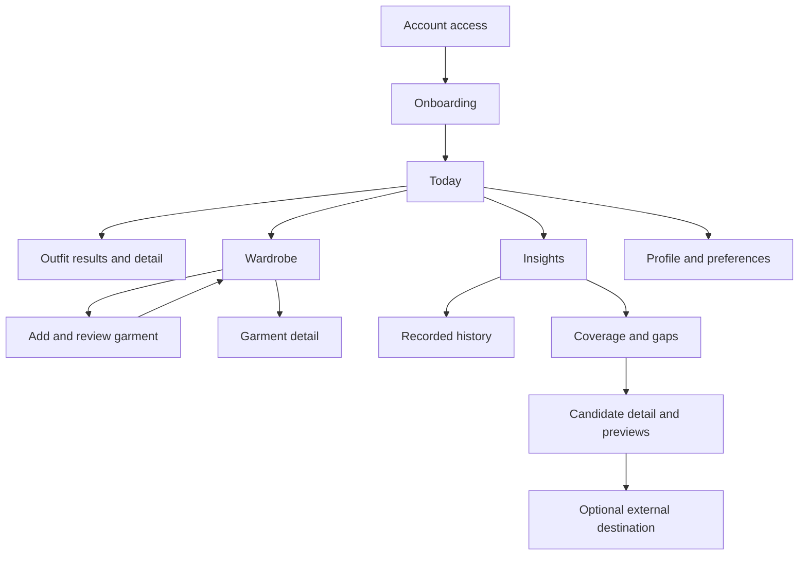
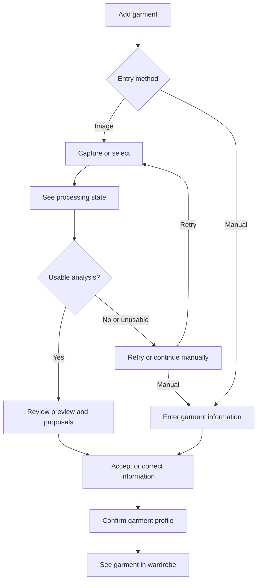
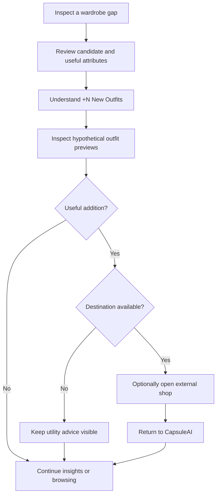

# CapsuleAI — Product Requirements Document

## 1. Document Control

| Field | Value |
|---|---|
| Document Name | CapsuleAI — Product Requirements Document |
| Product | CapsuleAI |
| Version | 0.1 |
| Status | Baseline Draft |
| Last Updated | 2026-10-05 |
| Primary Owner | Product Owner / Product |
| Approval Authority | Product Owner / Product Decision Authority |
| Reviewers | Business Analyst, UX/Product Design, Tech Lead, AI/ML Engineering, QA/Testing |
| Business Source of Truth | [docs/01-business/BRD.md](../01-business/BRD.md), version 0.2 |
| Process Authority | [CapsuleAI_Scrum_Development_Workflow.md](../../Initial%20files/CapsuleAI_Scrum_Development_Workflow.md) |
| Development Model | Scrum / Agile |
| Authoritative Product Location | `docs/02-product/PRD.md`, after review and acceptance |

### 1.1 Purpose and Authority

This PRD refines the established CapsuleAI business baseline into product experiences, journeys, features, states, and feature-level acceptance criteria. It supports Product, UX, Engineering, QA, and later requirements work without redefining the business goals or scope.

The BRD's approved business decisions govern this document even though its document status remains Baseline Draft. This PRD also remains a draft: creating it does not claim stakeholder acceptance. After acceptance, this location becomes the product source of truth; the older root PRD remains a historical source.

### 1.2 Source Documents and Reconciliation

| Source | Use in This PRD |
|---|---|
| [BRD v0.2](../01-business/BRD.md) | Authoritative positioning, BG-01–BG-04, BR-001–BR-024, CAP-01–CAP-10, scope, personas, constraints, and trust commitments. |
| [Scrum Development Workflow](../../Initial%20files/CapsuleAI_Scrum_Development_Workflow.md) | Process authority for artifact order, ownership, traceability, review, and change propagation. |
| [Existing root PRD](../../Product%20Requirements%20Document_%20CapsuleAI.md) | Earlier capture/review, outfit choice, item shuffle, and shopping-preview experiences; normalized against the BRD. |
| [Implementation Summary](../../Initial%20files/CapsuleAI_Implementation_Summary.md) | Consolidated context and explicit decisions in Section 15; technical descriptions remain outside this PRD. |
| [DA 2 Proposal](../../Initial%20files/DA%202%20Proposal.md) and official project outline referenced in BRD SRC-06 | Earlier user problems and product context; superseded descriptions do not override the BRD. |
| [Business Analysis notes](../../Business%20Analysis.docx) | Exploratory context only; commercial experiments are not approved MVP features. |
| [README](../../README.md) | Product identity; no additional requirements. |
| [Food Delivery BRD reference](../../docs%20tham%20kh%E1%BA%A3o/BRD_FoodDelivery.md) | Structural reference only; no domain content is transferred. |

Conflict precedence is: explicit BRD decisions; explicit later CapsuleAI decisions in current artifacts; the workflow for process and artifact rules; the old PRD and Implementation Summary; earlier proposals/outlines; exploratory notes. No later product decision file was found that changes the BRD baseline. Any proposed business change must first follow business-baseline change control.

| Earlier Description | Normalized Product Position |
|---|---|
| Three largely isolated features and narrow category/color tags | Connected MVP, active personalization, rich garment intelligence, contextual coverage, and all ten business capabilities. |
| Exactly three outfits on every request | At least three distinct valid options when available; fewer or none explained honestly. |
| Fixed weather cutoffs and universal pattern/color heuristics | Validity precedes ranking; detailed compatibility rules and thresholds are downstream work. |
| Wear selection primarily stored as history | Like, Dislike, Wear This Today, and history actively influence lightweight personalization and utilization insight. |
| Six-second processing and one combined recognition/background-removal success claim | Approved 3–5 second direction; category and dominant-color accuracy assessed separately, with preview usability assessed separately. |
| Every shopping card requires a link, price, and durability rating | Utility advice works without a destination; price and longevity guidance appears only when credible and qualified. |
| Specific frameworks, storage, service routing, and security mechanisms | Retain user-visible outcomes such as private access, recovery, and removal from current advice; leave implementation choices to downstream artifacts. |
| Fixed five-Sprint roadmap | Product dependency sequence only; Product Backlog and Sprint Planning govern actual Sprint selection. |

### 1.3 Revision History

| Version | Date | Change | Status |
|---|---|---|---|
| 0.1 | 2026-10-05 | Created normalized PRD from BRD v0.2 and existing sources; expanded journeys, feature behavior, acceptance criteria, experience states, and traceability without changing the business baseline. | Baseline Draft |

### 1.4 Artifact Boundary

The BRD owns **why, who, business value, and business need**. This PRD owns **what users can do and experience**, including feature intent, navigation, journeys, feedback, states, feature-level acceptance criteria, and MVP product scope. The SRS will own **precise software requirements** derived from this PRD.

The progression is BRD → PRD → SRS, followed by the workflow's Business Rules, Use Cases, and delivery artifacts. This document does not define architecture, database structures, endpoints, implementation classes, infrastructure, detailed algorithms, formal UML specifications, backlog items, or implementation tasks. Its Mermaid diagrams are product visualizations; formal requirements/design diagrams remain later workflow artifacts.

## 2. Product Overview

CapsuleAI is a personalized wardrobe-intelligence and decision-support product. The initial experience is mobile-first on Android and iOS, designed for Vietnam and ready for later market expansion. Consumer web and desktop experiences are outside the MVP.

| Product Pillar | Product Experience |
|---|---|
| AI Digital Closet | Capture or select garment images, review assisted analysis, confirm a useful garment profile, and maintain a trustworthy wardrobe. |
| Context-Aware Styling | Choose valid outfits from owned garments for relevant weather, season, style, and occasion, then refine choices through feedback. |
| Wardrobe Intelligence & Strategic Shopping | Understand recorded utilization and contextual coverage, identify underserved capabilities, and evaluate the incremental utility of candidate garments. |

The value loop is digitize → understand → recommend → learn from behavior → analyze gaps → improve the wardrobe → repeat. Improvement can mean using existing garments better; purchasing is optional. AI reduces entry effort, while user confirmation establishes authoritative garment information. Explicit preferences and meaningful interactions improve ranking without requiring advanced learned models.

The initial garment categories are **Top, Bottom, Outerwear, and Footwear**. A candidate garment is hypothetical, not an owned garment, until the user separately adds and confirms it.

## 3. Relationship to the BRD

This PRD preserves the BRD's four business goals, ten capabilities, three personas, market direction, complete MVP, and commercial boundary. Features refine BRD needs into observable user behavior; they do not replace BR-* statements.

Product terms retain their BRD meanings: a confirmed garment profile is authoritative; validity excludes unsuitable combinations before ranking; coverage is a contextual estimate; a gap is an underserved wardrobe capability; the Wardrobe Multiplier counts newly enabled unique valid outfits under the same context. Sections 9 and 33 provide forward and reverse traceability.

New FEAT-* and JRN-* identifiers are stable within the product layer. Acceptance criteria are scoped to their feature, for example `FEAT-AI-002/AC-01`. These criteria are not a second set of formal SRS requirement IDs. Later system requirements must retain their feature and business links.

## 4. Product Goals and Outcomes

| Product Goal | BRD Goal | Product Outcome |
|---|---|---|
| Make a usable wardrobe easier to establish | BG-01 — Reduce Wardrobe Digitization Effort | Assisted entry, understandable review, correction, and manual continuation reduce entry friction. |
| Make daily choices easier | BG-02 — Reduce Outfit Decision Effort | Relevant, valid, explained choices support faster selection and useful item substitution. |
| Help users use what they own | BG-03 — Increase Wardrobe Utilization | Meaningful feedback, recorded wear, variety, and coverage insights reveal useful combinations and overlooked garments. |
| Help users assess additions | BG-04 — Improve Purchase Quality | Gap-based candidates, incremental outfit counts, and hypothetical previews support informed evaluation without purchase pressure. |

These outcomes are directions for validation, not claims of measured benefits. Section 24 links product signals to existing BRD metrics.

## 5. Target Users

| BRD Persona | Product Expectations | Principal Journeys |
|---|---|---|
| Indecisive Professional — primary | Low setup friction, quick daily choices, clear weather/occasion context, a useful shuffle, and simple wear selection. | JRN-01–JRN-05 |
| Fashion-Conscious Minimalist — secondary | Trustworthy wardrobe information, visible recorded utilization, contextual coverage, and no manufactured need to buy. | JRN-02, JRN-03, JRN-05, JRN-06 |
| Smart Shopper — secondary | A clear gap rationale, candidate attributes, defensible incremental utility, realistic hypothetical previews, and optional shopping navigation. | JRN-06, JRN-07 |

These are overlapping behavioral archetypes, not account types or eligibility restrictions. Full persona context remains in BRD Section 11.

## 6. Product Experience Principles

| Principle | Practical Consequence |
|---|---|
| Low-friction wardrobe creation | Capture guidance and assisted proposals reduce effort; optional information does not become an onboarding barrier. |
| User authority | Users review, correct, confirm, edit, and remove wardrobe information; AI cannot silently overrule confirmed values. |
| Validity before preference | Invalid combinations are excluded before personalized ranking, including during shuffle and hypothetical evaluation. |
| Useful choice | Provide distinct valid options; never pad a result with duplicates or invalid combinations to meet a target. |
| Active, transparent personalization | Style, occasion, feedback, and recorded wear affect relevant experiences, with understandable explanations. |
| Inclusive personalization | Body and gender are optional, editable, removable, and non-restrictive; explicit preferences and wardrobe information remain primary. |
| Explainability | Explain recommendation context, coverage, gaps, candidate utility, and uncertainty in plain language. |
| Graceful degradation | Offer manual entry, reduced-context advice where valid, and clear recovery paths when dependencies fail. |
| Honest evidence | Unknown information, missing history, and hypothetical outfits are labeled; no fabricated scores, wear, sales, or validation results. |
| Commerce independence | Insights remain useful without a purchase or link; advice does not manufacture urgency. |
| Privacy and control | Personal images, preferences, and behavior are available only to authorized users and handled with understandable controls. |

## 7. Product Information Architecture

### 7.1 Navigation Model

The draft mobile navigation uses four primary areas: **Today**, **Wardrobe**, **Insights**, and **Profile**. Add Garment is a prominent action from Today and Wardrobe. Candidate evaluation is reached from a gap or related insight rather than making a storefront the primary experience.

These are product navigation responsibilities, not mandated tab placement, gestures, or pixel layouts. UX may refine labels and presentation while preserving entry points and relationships.

### 7.2 Screen / Product Area Inventory

| Area / Screen | Purpose and Key Information | Primary Actions / Connections |
|---|---|---|
| Account Access | Registration, login, access explanation, and actionable errors. | Enter onboarding or return to the personal product experience. |
| Onboarding / Preferences | Style/occasion needs; optional body, gender, and location context. | Set or skip optional context; add garments; return through Profile. |
| Today | Current context and entry to daily outfit choices. | Adjust occasion/context; request outfits; add a garment; access outfit detail. |
| Wardrobe Overview | Garment cards, category/color identification, and meaningful utilization indicators. | Browse, search, filter, open detail, add garment. |
| Add Garment / Processing / Review | Capture/gallery/manual entry, processing feedback, preview, proposals, uncertainty, and confirmation. | Retry, correct, enter manually, confirm, or cancel; return to Wardrobe. |
| Garment Detail | Confirmed profile, provenance/uncertainty where useful, and recorded use. | Edit, remove, or return to wardrobe/results. |
| Outfit Results / Detail | Outfit visualization, context, concise reasons, and garment details. | Shuffle an item; Like/Dislike; Wear This Today; inspect a garment. |
| Insights / Recorded History | User-reported outfit selections, garment utilization, variety, and analysis limitations. | Review history; inspect garments; open coverage assessment. |
| Wardrobe Coverage / Gaps | Assessment context, score, covered needs, underserved capabilities, and data limitations. | Change supported assessment context; inspect a gap or improve wardrobe information. |
| Candidate Recommendations / Detail | Gap addressed, useful attributes, +N New Outfits, hypothetical previews, and qualified optional guidance. | Inspect candidate/previews, continue browsing, or open an available external destination. |
| Profile / Preferences | Current preferences, optional personal context, manual location, and explanations of personalization. | Edit/remove optional information; update preferences; log out. |

### 7.3 Product Navigation Visualization

This diagram shows entry points and user movement between product areas. It helps the team understand how the connected value proposition is reached without prescribing screen layout.

Today, Wardrobe, Insights, and Profile remain directly reachable through primary navigation; the diagram shows meaningful journey connections rather than every navigation edge. External navigation is an optional exit, not an in-product purchase flow.

## 8. Core User Journeys

Journey identifiers describe end-to-end experiences. Detailed behavior and acceptance criteria reside in the linked features.

### 8.1 JRN-01 — Account Onboarding & Personalization

**Intent:** Establish private access and useful initial context without demanding sensitive information.

1. The user registers or logs in and receives clear success or recovery feedback.
2. Onboarding explains wardrobe ownership, AI review, and the value of style/occasion preferences.
3. The user supplies preferences and can omit optional body/gender information.
4. The user may permit device location, choose a city manually, or continue with a clearly limited environmental context.
5. The product directs the user to add garments or Today; missing optional information can be supplied later through Profile.

**Completion:** An authenticated user can access the product with an honestly described context. Incomplete onboarding is distinguishable from failed authentication and does not block access because optional fields are missing.

**Recovery:** Authentication failure offers retry; denied device permissions lead to manual alternatives. Initial capsule-needs choices and interface languages remain OPQ-001/OPQ-002. **Features:** FEAT-AUTH-001, FEAT-PROF-001, FEAT-PROF-002.

### 8.2 JRN-02 — Garment Digitization

**Intent:** Turn a real owned garment into a trustworthy wardrobe entry with minimal effort.

1. From Today or Wardrobe, the user captures an image, selects one from the gallery, or chooses manual entry.
2. Image guidance helps avoid unclear garment photos; processing shows progress rather than a completed entry.
3. The user sees an available processed preview and proposed garment information, including uncertainty where relevant.
4. The user reviews and corrects classification, color, and other useful attributes; missing or uncertain information can be entered manually.
5. The user confirms the profile and receives clear wardrobe-addition confirmation; the garment becomes available to wardrobe-based advice.

**Recovery:** Poor images support replacement; AI failure supports retry or manual continuation. Low confidence never silently becomes authoritative data. Canceling a draft does not create a confirmed garment.

The following visualization focuses on the user's review choices and recovery paths, rather than the BRD's business processing flow.

A prediction can still require correction even when usable. Only the user's confirmation creates the authoritative wardrobe entry; AI availability and optional profile data are not conditions for manual completion. **Features:** FEAT-AI-001, FEAT-AI-002, FEAT-GAR-001.

### 8.3 JRN-03 — Wardrobe Management

**Intent:** Keep the product aligned with what the user currently owns.

1. The user browses garment cards or searches/filters the wardrobe.
2. Garment detail presents confirmed information and recorded utilization without implying observed physical wear.
3. The user edits inaccurate or changed information and confirms the revision.
4. The user can remove a garment through an explicit, understandable removal action.
5. Subsequent recommendations and assessments reflect the current confirmed wardrobe; removed garments cannot remain selectable as owned items.

**Recovery:** Empty wardrobes prompt Add Garment; no search results offer changes to the search/filter; failed edits/removals retain a clear unconfirmed state and retry. Treatment of previously recorded history after removal is OPQ-007. **Features:** FEAT-WAR-001–FEAT-WAR-003, FEAT-ANL-001.

### 8.4 JRN-04 — Daily Outfit Recommendation

**Intent:** Choose an appropriate outfit from owned garments with useful control.

1. The user opens Today, checks the environmental context and selected occasion/style, and requests recommendations.
2. The product considers the current confirmed wardrobe and available context, excludes invalid combinations, then ranks valid options using preferences and meaningful behavior.
3. The user sees at least three distinct valid options when available, or an explanation for fewer/no options.
4. Outfit detail explains relevant context and compatibility in plain language.
5. The user may shuffle one item while keeping the other selected garments fixed; only compatible alternatives are offered.
6. The user can Like, Dislike, or select Wear This Today. Context changes cause refreshed evaluation rather than retaining an unsupported claim of suitability.

**Completion:** The user can make an informed selection without needing a purchase. **Recovery:** Missing weather is disclosed; usable reduced-context advice remains available where validity can be established. Missing compatible garments or shuffle alternatives produce useful guidance, not fabricated choices. **Features:** FEAT-OUT-001, FEAT-OUT-002, FEAT-OUT-003, FEAT-PERS-001–FEAT-PERS-003.

### 8.5 JRN-05 — Behavioral Personalization

**Intent:** Improve relevant choices through ordinary interactions rather than a lengthy preference survey.

1. The user provides Like/Dislike or reports Wear This Today; the product confirms the recorded meaning.
2. Explicit style/occasion preferences and these signals inform future valid-outfit ranking.
3. Recorded wear also informs recency, variety, and utilization views; Like does not become a wear record.
4. The user can revise feedback and optional profile context; later advice reflects the current signal rather than continuing to apply a superseded preference.
5. Explanations describe relevant preference/history influences without showing numerical weights or promising immediate identical effects on every result.

**Recovery:** Unsuccessful recording is distinguishable from success and can be retried. A user with no feedback still receives valid recommendations from wardrobe and available explicit context. **Features:** FEAT-PERS-001–FEAT-PERS-003, FEAT-ANL-001.

### 8.6 JRN-06 — Wardrobe Coverage & Gap Analysis

**Intent:** Understand how existing clothes serve the user's needs.

1. The user opens Insights and reviews the selected capsule-needs profile, style/occasion needs, and climate/context.
2. When the information supports assessment, the product presents a Wardrobe Coverage Score with its context and limitations.
3. The user sees covered and underserved needs and can inspect the evidence for a gap.
4. A gap describes a capability, such as versatile neutral casual footwear, with possible useful candidate characteristics.
5. The user can improve wardrobe/context information, explore existing combinations, or inspect suitable additions. No important gap means no manufactured shopping need.

**Recovery:** Insufficient data produces an explanation and an appropriate next action rather than an arbitrary low or perfect score. The illustrative footwear example is not a universal wardrobe rule. **Features:** FEAT-ANL-002, FEAT-GAP-001, FEAT-PROF-001, FEAT-PROF-002.

### 8.7 JRN-07 — Strategic Shopping / Wardrobe Multiplier

**Intent:** Evaluate a possible addition before deciding whether it is useful.

1. From a gap, the user opens a candidate and sees the capability addressed and relevant garment attributes.
2. The product presents **+N New Outfits**, evaluated against the current wardrobe under the same context.
3. The user inspects newly enabled hypothetical outfits; the candidate is visibly distinguished from owned items.
4. Credible price or longevity guidance may supplement utility, with qualifications and missing information disclosed.
5. The user can continue browsing, decline the suggestion, or follow an available external shopping destination.
6. Returning from that destination does not record a verified purchase or automatically add the candidate to the wardrobe.

This visualization makes the candidate decision and optional external exit explicit.

The count is incremental utility, not a purchase recommendation score or proof of savings. Evaluation remains useful without a destination. **Recovery:** No useful candidate, unavailable links, or an outdated assessment is explained before unsupported advice is shown. **Features:** FEAT-GAP-001, FEAT-MULT-001, FEAT-SHOP-001, FEAT-SHOP-002.

## 9. Product Feature Catalog

Prefixes group stable product features by responsibility: AUTH access, PROF context, AI ingestion, GAR garment intelligence, WAR management, OUT outfit interaction, PERS personalization, ANL analytics, GAP gaps, MULT multiplier, SHOP shopping advice, and MET measurement. IDs remain stable through later refinement.

| Feature ID | Feature | Specification | MVP |
|---|---|---|---|
| FEAT-AUTH-001 | Personal account access and session continuity | Section 10 | Yes |
| FEAT-PROF-001 | Preferences and inclusive optional profile | Section 11.1 | Yes |
| FEAT-PROF-002 | Location and environmental context | Section 11.2 | Yes |
| FEAT-AI-001 | Image entry and assisted preview | Section 12.1 | Yes |
| FEAT-AI-002 | Review, confirmation, and manual entry | Section 12.2 | Yes |
| FEAT-GAR-001 | Rich garment intelligence experience | Section 13 | Yes |
| FEAT-WAR-001 | Wardrobe overview and garment detail | Section 14.1 | Yes |
| FEAT-WAR-002 | Edit and remove garments | Section 14.2 | Yes |
| FEAT-WAR-003 | Wardrobe search and filtering | Section 14.3 | Yes |
| FEAT-OUT-001 | Valid, personalized daily outfit choices | Section 15.1 | Yes |
| FEAT-OUT-002 | Outfit detail and reasoning | Section 15.2 | Yes |
| FEAT-OUT-003 | Shuffle one garment | Section 16.1 | Yes |
| FEAT-PERS-001 | Like and Dislike feedback | Section 16.2 | Yes |
| FEAT-PERS-002 | Wear This Today selection | Section 16.3 | Yes |
| FEAT-PERS-003 | Active behavioral personalization | Section 16.4 | Yes |
| FEAT-ANL-001 | Recorded history and utilization | Section 17.1 | Yes |
| FEAT-ANL-002 | Contextual Wardrobe Coverage Score | Section 17.2 | Yes |
| FEAT-GAP-001 | Capability-based gap analysis | Section 18 | Yes |
| FEAT-MULT-001 | Wardrobe Multiplier and hypothetical previews | Section 19 | Yes |
| FEAT-SHOP-001 | Utility-led candidate advice | Section 20.1 | Yes |
| FEAT-SHOP-002 | Optional external shopping navigation | Section 20.2 | Yes |
| FEAT-MET-001 | Privacy-respecting product measurement | Section 24 | Yes |

All feature behavior is governed by the cross-cutting states, explainability, privacy, and quality expectations in Sections 21–25. Section 33 maps every feature to its BRD requirements and capabilities.

## 10. Account & Authentication Features

### 10.1 FEAT-AUTH-001 — Personal Account Access and Session Continuity

**Purpose:** Establish authorized access to a user's personal wardrobe and context.

**User value:** The user can return to their information without exposing another person's wardrobe.

**Related BRD:** BR-021, BR-023; CAP-01; BG-01–BG-04. **Primary users:** All three personas.

**Entry points / trigger:** Account Access, launch with no usable session, or an action requiring renewed authentication. **Preconditions:** Access to the connected mobile product; registration/login method is pending OPQ-008.

**Product behavior:**

1. Provide registration, login, and clear feedback about completion or failure.
2. On successful access, show the user's own wardrobe and preferences; first use leads to onboarding.
3. Preserve usable access across ordinary navigation and return visits while the session remains valid.
4. If authentication is required again, explain it and return the user to the intended personal area after successful login where practical.
5. Logout ends authenticated access and removes personal information from the active signed-out experience.

**User controls:** Register, log in, retry, and log out. **Product states:** Signed out, submitting, authenticated, access failed, renewal required, onboarding incomplete.

**Failure / fallback:** Explain invalid or incomplete input and connectivity failure with a useful retry path. Never present another account's data as recovery. Optional onboarding fields do not prevent authenticated access.

**Feature-level acceptance criteria:**

- **AC-01:** Successful registration/login opens the correct personal experience; signed-out users cannot open protected personal wardrobe information.
- **AC-02:** Failed access is distinguishable from successful access and provides an actionable correction or retry.
- **AC-03:** Logout prevents continued access to the user's protected information until authentication succeeds again.
- **AC-04:** A valid returning session preserves access to the user's wardrobe; expired access requires authentication rather than showing it as an empty wardrobe.
- **AC-05:** Missing optional body, gender, or device-location permission does not prevent account access.

**Out of scope / deferred detail:** Authentication mechanisms, session durations, security protocol, and credential policy belong downstream. Specific sign-in methods require a product decision; social sign-in, account recovery channels, and guest accounts are not assumed MVP additions.

## 11. Profile & Personalization Features

### 11.1 FEAT-PROF-001 — Preferences and Inclusive Optional Profile

**Purpose:** Make relevant style and occasion needs available while respecting personal choice.

**User value:** Advice reflects the user's needs without requiring sensitive context or restricting clothing choices.

**Related BRD:** BR-010, BR-012, BR-014, BR-021, BR-022; CAP-01, CAP-06; BG-02–BG-04. **Primary users:** All three personas.

**Entry points / trigger:** Onboarding, Profile, occasion selection on Today, or coverage context review. **Preconditions:** Authenticated access; exact initial style/occasion/capsule choices await OPQ-001/OPQ-003.

**Product behavior:**

1. Explain why style preferences and occasion needs are useful; allow the user to set and revise supported choices.
2. Distinguish ongoing preferences/needs from the current recommendation occasion.
3. Offer body-profile and gender information as optional; allow omission, later edits, and removal.
4. Apply explicit preferences to relevant ranking and wardrobe analysis; body-profile context may softly refine ranking.
5. Explain that optional personal attributes do not prohibit garment categories or override the user's confirmed wardrobe and explicit preferences.

**User controls:** Select/change preferences, choose the current occasion, skip optional context, edit/remove optional information. **Product states:** Unset, partially configured, configured, editing, update failed.

**Failure / fallback:** Without complete context, disclose which assumptions or limited context advice uses. A failed change is not shown as saved.

**Feature-level acceptance criteria:**

- **AC-01:** The user can continue without body/gender information and later add, change, or remove it.
- **AC-02:** In a controlled comparison with relevant choices available, changing style or occasion meaningfully changes applicable advice or explanations.
- **AC-03:** Body/gender omission or changes do not independently exclude any of the four supported garment categories.
- **AC-04:** The chosen context is visible in the relevant assessment; removing optional information stops future use of that information.
- **AC-05:** Incomplete preferences produce an explained limited-context experience rather than invented personal attributes.

**Out of scope / deferred detail:** Detailed taxonomies, content wording, and exact onboarding progression require product refinement; ranking weights and internal profile representations are downstream. Body measurement, inferred gender, and restrictive body-based eligibility are outside scope.

### 11.2 FEAT-PROF-002 — Location and Environmental Context

**Purpose:** Supply useful environmental context without requiring device-location access.

**User value:** The user can obtain relevant weather context through permission-based or manual location choice.

**Related BRD:** BR-007, BR-013, BR-014, BR-022; CAP-01, CAP-05, CAP-07; BG-02, BG-04. **Primary users:** Especially Indecisive Professional; relevant to all personas.

**Entry points / trigger:** Onboarding, Profile, Today context review, or an unavailable-weather message. **Preconditions:** A supported manual location or consented device location for location-specific weather; connected access when weather is requested.

**Product behavior:**

1. Explain device-location purpose before requesting permission; the user can decline.
2. Offer manual city/location selection independently of permission, including after denial.
3. Show which location/environmental context informs recommendations and relevant assessments.
4. Allow the user to change the location used; refresh affected advice or mark it for reevaluation.
5. Distinguish unavailable weather from known weather; retain reduced-context recommendations where valid.

**User controls:** Grant/decline permission, select/change manual location, retry context retrieval. **Product states:** Unset, permission-based, manually selected, loading, available, unavailable.

**Failure / fallback:** Manual selection handles permission denial or device-location failure. If weather still cannot be obtained, explain the missing context; do not invent a forecast or claim weather suitability.

**Feature-level acceptance criteria:**

- **AC-01:** A user who denies device location can select a city and receive location-based weather when the weather dependency is available.
- **AC-02:** Recommendations disclose the location/context actually used.
- **AC-03:** Unavailable weather is clearly labeled; usable advice can continue with stated limitations where validity can be assessed.
- **AC-04:** Changing location cannot leave an older assessment presented as current for the new location.

**Out of scope / deferred detail:** Provider choice, retrieval frequency, location precision, and weather validity thresholds are downstream. Continuous background tracking is not an MVP requirement.

## 12. AI Digital Closet Features

### 12.1 FEAT-AI-001 — Image Entry and Assisted Preview

**Purpose:** Reduce garment-entry effort through usable image capture and assisted understanding.

**User value:** A clear preview and suggested attributes make confirmation easier than entering everything from scratch.

**Related BRD:** BR-001, BR-003, BR-004, BR-022; CAP-02, CAP-04; BG-01. **Primary users:** All personas creating or updating a wardrobe.

**Entry points / trigger:** Add Garment from Today or Wardrobe. **Preconditions:** An available garment image and permission for the chosen camera/gallery action; manual entry remains independent of image-processing availability.

**Product behavior:**

1. Offer capture and gallery selection with concise guidance about lighting, garment visibility, and avoiding confusing backgrounds.
2. Show the selected image and allow replacement/cancel before confirmation.
3. Show a processing state and an available isolated/processed garment preview, with proposed attributes for review.
4. Separate preview usability from attribute certainty; successful image processing does not prove every predicted value.
5. Direct the user to review, retry, or manual continuation without creating a confirmed garment automatically.

**User controls:** Capture/select/replace image, cancel, retry, or switch to manual entry. **Product states:** No image, selected, processing, preview available, unsuitable image, analysis failed.

**Failure / fallback:** Explain capture/permission/image/analysis problems; allow another available image route or manual entry. An unusable processed preview must not block manual creation when the original image is useful.

**Feature-level acceptance criteria:**

- **AC-01:** A captured or gallery-selected image can reach a reviewable preview and proposal state when analysis succeeds.
- **AC-02:** During processing, the product does not claim the garment has already been added.
- **AC-03:** Denied camera access does not eliminate supported gallery or manual alternatives.
- **AC-04:** An unsuitable image or processing failure offers replacement/retry and manual continuation.
- **AC-05:** Canceling entry before confirmation leaves no confirmed wardrobe item.

**Out of scope / deferred detail:** Image formats/limits, segmentation quality criteria, model/provider selection, processing stages, and permissions implementation are downstream. AR, 3D rendering, and real-time video are excluded.

### 12.2 FEAT-AI-002 — Review, Confirmation, and Manual Entry

**Purpose:** Make user-reviewed garment information authoritative.

**User value:** The user can correct automation and still create useful wardrobe entries during AI failure.

**Related BRD:** BR-001, BR-002, BR-003, BR-004, BR-005; CAP-02, CAP-03, CAP-04; BG-01–BG-04. **Primary users:** All personas.

**Entry points / trigger:** Available analysis, uncertainty/failure recovery, or direct manual entry. **Preconditions:** Authenticated access and enough user-provided information to confirm a usable garment profile; exact completeness criteria are downstream.

**Product behavior:**

1. Present predictions as proposals, identifying uncertain attributes and useful distinctions between AI-suggested, user-confirmed, user-corrected, and manually entered information.
2. Permit the user to accept, correct, or supply the garment dimensions described in Section 13.
3. Provide manual entry without requiring successful AI output; allow uncertain details to remain explicitly unknown where appropriate.
4. Require explicit confirmation before the garment becomes an authoritative owned wardrobe item.
5. Show completion and the added garment; later AI activity must not overwrite confirmed/corrected information silently.

**User controls:** Review, edit, replace uncertain information, retry analysis, enter manually, confirm, or cancel. **Product states:** Proposal available, low confidence, reviewing, manual entry, confirming, confirmed, save failed.

**Failure / fallback:** Keep the distinction between unsaved work and confirmed data clear. Offer retry while preserving entered work where practical; do not report success after a failed confirmation.

**Feature-level acceptance criteria:**

- **AC-01:** The user can correct an AI-proposed category or color before confirming; the saved garment uses the correction.
- **AC-02:** Representative AI-unavailable and low-confidence scenarios allow manual completion without a successful analysis.
- **AC-03:** No AI proposal becomes authoritative or eligible as an owned item before confirmation.
- **AC-04:** An uncertain material suggestion can be corrected or left unknown without a false claim of certainty.
- **AC-05:** A later analysis does not silently replace a previously confirmed user value.
- **AC-06:** A failed save is not shown as a successful wardrobe addition; retry does not result in an unexplained duplicate.

**Out of scope / deferred detail:** Required attribute completeness, confidence alert thresholds, provenance representation, save mechanics, and technical retry behavior belong to later requirements/design. Product choices about advanced review controls are OPQ-004/OPQ-005.

## 13. Garment Intelligence Features

### 13.1 FEAT-GAR-001 — Rich Garment Intelligence Experience

**Purpose:** Represent the garment information needed for styling, coverage, and candidate comparison.

**User value:** Users can understand and correct what the product knows about an item beyond a basic category/color tag.

**Related BRD:** BR-002, BR-003, BR-007, BR-009, BR-022; CAP-04; BG-01–BG-04. **Primary users:** All personas.

**Entry points / trigger:** Garment review, garment detail/edit, and relevant candidate information. **Preconditions:** A proposed or confirmed garment profile; unknown attributes remain distinguishable from verified information.

**Product behavior:** Provide the dimensions below in understandable review/detail experiences. Helpful primary information appears first; advanced color/shape concepts may use secondary detail and plain-language controls. Users are not required to calculate color coordinates or interpret internal numeric scales.

| Dimension | What Users See / Understand | AI Assistance, Correction, and Uncertainty |
|---|---|---|
| Classification | Primary category: Top, Bottom, Outerwear, or Footwear; useful subtype within that category. | Category/subtype may be suggested and corrected; future categories are not quietly introduced. |
| Layering & Shape | Layering role, relative bulk, fit, and silhouette in understandable terms. | Users can review/correct suggestions; missing information remains clear. Internal levels or numeric bulk measures need not be exposed as raw technical values. |
| Color | Dominant and secondary colors, warm/cool color character, and palette role where useful. HEX/HSL describe precise color information conceptually. | Swatches/names help correction; detailed color values may be shown in secondary detail without mandatory coordinate entry. Lighting-based uncertainty is explained where relevant. |
| Pattern | Pattern type, relative pattern density, and visual busyness/noise. | Suggested descriptors are editable; the product does not assume every pattern is confidently recognized. |
| Context | Season suitability, occasion associations, and style associations. | AI suggestions can be accepted or corrected; associations inform suitability rather than rigid stereotypes. |
| Material | Suggested or user-entered material and its uncertainty/confidence. | Image-based inference is not verification. Users can correct it or leave it unknown; a suggestion alone cannot support a certain durability claim. |

**User controls:** Inspect each dimension, correct supported descriptors, confirm, and revisit through edit. **Product states:** Suggested, uncertain/unknown, confirmed, corrected, editing.

**Failure / fallback:** Missing dimensions remain explicit; manual input is available where appropriate. Do not promise equal predictive accuracy across the richer attributes.

**Feature-level acceptance criteria:**

- **AC-01:** Review and detail cover classification, layering/shape, color, pattern, contextual attributes, and material without requiring technical schema knowledge.
- **AC-02:** Each supported dimension can be reviewed and corrected through understandable controls; final user values remain authoritative.
- **AC-03:** Material uncertainty is visible when relevant and cannot be mistaken for verified fabric composition.
- **AC-04:** Unknown information is not silently displayed as a confident prediction or user confirmation.
- **AC-05:** Initial classification remains within the four approved categories; advanced color detail does not become a mandatory technical onboarding task.

**Out of scope / deferred detail:** Exact subtype/descriptor vocabularies, allowable combinations, internal HEX/HSL representation, numeric scales, validation rules, and inference algorithms are downstream. User-visible vocabularies and progressive detail require OPQ-003/OPQ-004.

## 14. Wardrobe Management Features

### 14.1 FEAT-WAR-001 — Wardrobe Overview and Garment Detail

**Purpose:** Make the confirmed owned wardrobe understandable and accessible.

**User value:** Users can find what they own and check the information behind recommendations.

**Related BRD:** BR-005, BR-006, BR-021, BR-022; CAP-03, CAP-07; BG-01–BG-03. **Primary users:** All personas; especially Fashion-Conscious Minimalist.

**Entry points / trigger:** Wardrobe, completed ingestion, or garment selection from an outfit/insight. **Preconditions:** Authenticated access; a populated wardrobe is not required to open the area.

**Product behavior:**

1. Show owned garment cards with an available image, category/subtype, and dominant-color identification.
2. Offer relevant recorded-use indicators with clear meaning, including no recorded use.
3. Open garment detail for confirmed information, useful provenance/uncertainty, and recorded utilization.
4. Provide Add Garment and access to search/filter/edit/remove actions.
5. Distinguish empty wardrobe from loading, unavailable information, and no matching search results.

**User controls:** Browse, open/return from detail, add, and move to management or insights. **Product states:** Loading, empty, populated, detail available, load failed.

**Failure / fallback:** A load failure offers retry rather than falsely claiming zero possessions. Missing images do not conceal otherwise available confirmed garment information.

**Feature-level acceptance criteria:**

- **AC-01:** Confirmed additions appear in the user's wardrobe and open their corresponding details.
- **AC-02:** Garment cards identify category/color usefully; detail presents the current confirmed profile.
- **AC-03:** Empty wardrobes explain the value of adding garments and provide an Add Garment action.
- **AC-04:** No recorded wear is labeled as missing history rather than proof that a garment is never worn.
- **AC-05:** A data-loading failure is distinguishable from an empty wardrobe.

**Out of scope / deferred detail:** Pixel layout, collection organization, advanced sorting, pagination, and storage are not defined here. Shared/public wardrobes are outside MVP.

### 14.2 FEAT-WAR-002 — Edit and Remove Garments

**Purpose:** Keep wardrobe-based advice aligned with current possessions and corrections.

**User value:** Inaccurate entries and garments no longer owned do not distort current recommendations.

**Related BRD:** BR-002, BR-004, BR-005, BR-021; CAP-03, CAP-04; BG-01–BG-04. **Primary users:** All personas.

**Entry points / trigger:** Garment detail or an identified incorrect entry. **Preconditions:** An existing garment belonging to the user.

**Product behavior:**

1. Allow supported profile information to be edited and explicitly confirmed.
2. Explain garment removal and require a deliberate confirmation before applying it.
3. After a successful change, current wardrobe displays use the new state.
4. Refresh or clearly require reevaluation of affected recommendations, coverage, and multiplier estimates.
5. Removed garments are no longer eligible as owned items in current outfit selection or newly computed advice.

**User controls:** Edit, confirm/cancel edits, confirm/cancel removal. **Product states:** Viewing, editing, confirmation pending, updating/removing, complete, failed.

**Failure / fallback:** Do not claim a change succeeded if it did not. Preserve useful entered work where practical and offer retry; keep unresolved changes distinct from the authoritative current state.

**Feature-level acceptance criteria:**

- **AC-01:** A confirmed profile edit appears in detail and subsequently evaluated advice.
- **AC-02:** Canceling an edit/removal leaves the confirmed garment unchanged.
- **AC-03:** Successfully removed garments disappear from the current wardrobe and cannot be selected as owned items in new recommendations.
- **AC-04:** An affected older recommendation/utility result is refreshed or marked for reevaluation, not silently represented as current.
- **AC-05:** Failed changes remain visibly unconfirmed and offer recovery.

**Out of scope / deferred detail:** Physical deletion, image handling, retained history representation, and consistency mechanisms are downstream. Product history presentation after removal is OPQ-007; no archive/restore feature is assumed.

### 14.3 FEAT-WAR-003 — Wardrobe Search and Filtering

**Purpose:** Make a growing wardrobe discoverable.

**User value:** Users can locate garments without scrolling through unrelated items.

**Related BRD:** BR-005; CAP-03; BG-01–BG-03. **Primary users:** All personas.

**Entry points / trigger:** Wardrobe Overview. **Preconditions:** Authenticated access; confirmed garments with searchable/relevant attributes.

**Product behavior:**

1. Offer text search across understandable garment descriptors and filters for useful confirmed attributes, including category and color.
2. Display active search/filter conditions and allow their removal.
3. Open matching garment detail without changing wardrobe information.
4. Distinguish no match from an empty wardrobe and suggest changing or clearing conditions.

**User controls:** Enter/change search, select/clear filters, open a result. **Product states:** Unfiltered, searching/filtering, matches, no matches, retrieval failed.

**Failure / fallback:** Explain retrieval failure and retry without implying the wardrobe or matching garments were deleted.

**Feature-level acceptance criteria:**

- **AC-01:** Category/color filters show matching confirmed garments and exclude known nonmatches.
- **AC-02:** Searching a known supported descriptor can find the corresponding garment.
- **AC-03:** Clearing conditions restores the unfiltered wardrobe.
- **AC-04:** No-match feedback provides a useful reset path distinct from Add Garment guidance for an empty wardrobe.

**Out of scope / deferred detail:** Exact searchable vocabularies, matching semantics, optional extra filters/sort order, and search implementation are downstream. Visual similarity search is not an MVP requirement.

## 15. Outfit Recommendation Features

### 15.1 FEAT-OUT-001 — Valid, Personalized Daily Outfit Choices

**Purpose:** Offer contextually useful outfit choices from the user's confirmed owned garments.

**User value:** The user can make a daily decision with appropriate choices instead of assembling every combination manually.

**Related BRD:** BR-007, BR-008, BR-009, BR-010, BR-011, BR-012, BR-013, BR-022, BR-024; CAP-05, CAP-06; BG-02, BG-03. **Primary users:** Especially Indecisive Professional; useful to all personas.

**Entry points / trigger:** Today, a recommendation request, or changed relevant context. **Preconditions:** Current confirmed wardrobe; available context sufficient to establish valid combinations. Missing optional personalization does not independently block recommendations.

**Product behavior:**

1. Make the active occasion, style preference, and available environmental context understandable.
2. Apply hard validity constraints for required garment roles, layering, weather/season suitability, strong incompatibility, and relevant pattern/noise conflicts.
3. Rank only valid candidates using color harmony, style, occasion, explicit feedback, recorded wear/recency, diversity, and relevant optional soft context.
4. Present at least three distinct valid outfits when the wardrobe/context permits; garment-identity combinations repeated in a different order are not new outfits.
5. Show fewer valid choices or none with an explanation when appropriate, without duplicate padding or invalid substitutions.
6. On relevant wardrobe or context changes, reevaluate results; do not retain unsupported suitability claims. Requests/refreshes remain subject to the same validity and ranking principles.

**User controls:** Request/refresh advice, change supported context, inspect options, and use detail/interaction controls. **Product states:** Loading, available, fewer than three, none valid, context incomplete, weather unavailable, request failed.

**Failure / fallback:** Explain missing compatible roles or context and suggest a relevant action. With unavailable weather, offer reduced-context advice only where validity can still be established and disclose the limitation. Do not present an old result as freshly evaluated after failure.

**Feature-level acceptance criteria:**

- **AC-01:** A fixture with at least three distinct valid combinations produces at least three valid distinct options.
- **AC-02:** A fixture with only one or two valid combinations shows those options and explains limited choice; a fixture with none shows a useful no-valid-outfit state.
- **AC-03:** Every daily outfit uses confirmed owned garments; an unconfirmed draft or hypothetical candidate is not an owned item.
- **AC-04:** An invalid outfit is excluded even when its garments have strong positive feedback.
- **AC-05:** In suitable controlled fixtures, style, occasion, and active behavioral signals have observable effects on valid-outfit ordering or selection.
- **AC-06:** A context change or removed garment cannot leave an affected result presented as current without reevaluation or an explicit stale-state explanation.

**Out of scope / deferred detail:** Detailed slot/compatibility rules, temperature thresholds, taxonomy, ranking weights, candidate generation, and exhaustive-result limits belong downstream. Advanced learned ranking and a rigid universal one-pattern rule are not requirements.

### 15.2 FEAT-OUT-002 — Outfit Detail and Reasoning

**Purpose:** Make recommendations inspectable and understandable.

**User value:** The user can decide whether advice fits their situation and access the garments behind it.

**Related BRD:** BR-007, BR-009, BR-022; CAP-04, CAP-05; BG-02, BG-03. **Primary users:** All personas.

**Entry points / trigger:** Open an outfit from recommendation results or a relevant recorded selection. **Preconditions:** A displayed outfit and its assessment context; historical context is distinguished from current advice.

**Product behavior:**

1. Show the outfit visually with identifiable garments and access to their details.
2. Explain the relevant occasion/style/environmental context and concise compatibility or preference reasons.
3. Expose Shuffle, Like/Dislike, and Wear This Today for applicable current owned-outfit recommendations.
4. Disclose missing context and limitations rather than presenting inference as verified personal preference.
5. Distinguish current recommendations, past user-reported selections, and hypothetical candidate previews.

**User controls:** Inspect garments/reasoning, return to results, and invoke applicable interactions. **Product states:** Current detail, historical detail, limited context, unavailable/needs reevaluation.

**Failure / fallback:** If a garment is no longer available or the assessment is outdated, explain it and offer return/refresh. Hypothetical previews cannot be recorded as an owned outfit through Wear This Today.

**Feature-level acceptance criteria:**

- **AC-01:** The user can identify the garments and understand at least the relevant context and recommendation rationale.
- **AC-02:** Missing weather or personal context is disclosed in affected reasoning.
- **AC-03:** Reasons are consistent with confirmed garment information and the context actually evaluated.
- **AC-04:** Historical selections and hypothetical previews cannot be mistaken for current owned-outfit advice.

**Out of scope / deferred detail:** Exact card/detail copy and visual composition require UX refinement. Internal scores, rule execution traces, and algorithm explanation are not required user-facing content.

## 16. Interaction & Behavioral Personalization

### 16.1 FEAT-OUT-003 — Shuffle One Garment

**Purpose:** Let the user refine a valid outfit without restarting the whole choice.

**User value:** A preferred combination can be retained while one garment changes.

**Related BRD:** BR-007, BR-008, BR-009, BR-022; CAP-05; BG-02, BG-03. **Primary users:** Especially Indecisive Professional.

**Entry points / trigger:** Shuffle a selected garment slot in a current outfit. **Preconditions:** A current owned outfit and an identified slot; alternatives must satisfy the same context and fixed garments.

**Product behavior:**

1. Identify the item to replace and retain all other selected garments.
2. Evaluate alternatives from the current confirmed wardrobe for compatibility with that retained combination.
3. Show a compatible replacement when available; preference ranking applies only among valid alternatives.
4. If none exists, retain the current outfit and explain why a replacement cannot be offered at an appropriate level.

**User controls:** Select a slot and request another compatible item; return to the original choice through ordinary navigation/reselection. **Product states:** Current choice, finding alternative, replacement available, no alternative, failed.

**Failure / fallback:** A failure or no alternative must not unexpectedly replace other garments or inject an incompatible item. Offer retry or retain the current choice.

**Feature-level acceptance criteria:**

- **AC-01:** A successful shuffle changes only the chosen slot and preserves the other selected garment identities.
- **AC-02:** The resulting outfit remains valid under the same active context.
- **AC-03:** With no compatible alternative, the outfit stays intact and a clear explanation appears.
- **AC-04:** Shuffle is not automatically interpreted as a Like, Dislike, or reported wear.

**Out of scope / deferred detail:** Alternative-selection algorithm, cycling order, and compatibility thresholds belong downstream. Whole-outfit regeneration is distinct from this control.

### 16.2 FEAT-PERS-001 — Like and Dislike Feedback

**Purpose:** Capture explicit preference signals for future relevant advice.

**User value:** The user can shape recommendation relevance without editing every preference.

**Related BRD:** BR-011, BR-021, BR-022; CAP-06; BG-02, BG-03. **Primary users:** All personas.

**Entry points / trigger:** Feedback controls on applicable outfit results/detail. **Preconditions:** An identified recommendation; the user understands feedback is about preference, not verified wear.

**Product behavior:**

1. Provide clearly distinguishable Like and Dislike actions and show the current recorded feedback state.
2. Like indicates a positive preference; Dislike indicates a negative preference and reduces similar unsuitable advice conceptually.
3. Allow the user to change or clear accidental feedback; contradictory simultaneous Like/Dislike states must not persist for the same feedback target.
4. Use current feedback in later lightweight personalization without overriding validity or permanently banning garment categories.

**User controls:** Like, Dislike, change/clear feedback. **Product states:** No feedback, liked, disliked, recording, failed.

**Failure / fallback:** Explain unsuccessful recording and retry; do not claim future personalization has changed when the signal was not accepted.

**Feature-level acceptance criteria:**

- **AC-01:** Like/Dislike visibly records the corresponding preference and does not create wear history.
- **AC-02:** Changing/clearing feedback updates the effective signal and displayed state.
- **AC-03:** In controlled relevant fixtures, feedback can influence later valid-outfit ranking; it never makes an invalid outfit eligible.
- **AC-04:** A failed action is distinguishable from recorded feedback and offers recovery.

**Out of scope / deferred detail:** Feedback-target representation, similarity rules, strength, aggregation, and retention rules belong downstream. Detailed reason surveys are not an MVP requirement.

### 16.3 FEAT-PERS-002 — Wear This Today Selection

**Purpose:** Record a user-reported daily outfit selection as a strong positive signal.

**User value:** The user can track selected outfits and improve future advice through a simple action.

**Related BRD:** BR-006, BR-011, BR-021, BR-022; CAP-06, CAP-07; BG-02, BG-03. **Primary users:** Especially Indecisive Professional and Fashion-Conscious Minimalist.

**Entry points / trigger:** Wear This Today on a current valid owned outfit. **Preconditions:** Authenticated access and a current owned-outfit selection; hypothetical candidates are excluded.

**Product behavior:**

1. Clearly confirm that the user reported selecting the outfit for today.
2. Make the selected outfit and related garment use visible in recorded history.
3. Treat the selection as stronger positive preference evidence than a Like, and as relevant recorded-use/recency evidence.
4. Permit correction of an accidental report; repeated taps/retries do not manufacture additional wear.
5. Avoid claiming physical wear was observed or verified.

**User controls:** Report today's selection and correct an accidental report. **Product states:** Unreported, recording, reported, correction pending, failed.

**Failure / fallback:** Show whether recording succeeded; provide retry/correction without unexplained duplicate history. Daily repeated-selection semantics require OPQ-006.

**Feature-level acceptance criteria:**

- **AC-01:** A successful action appears as a user-reported selection in history and contributes to relevant garment utilization.
- **AC-02:** Like alone does not create this record; Wear This Today supplies the stronger positive signal.
- **AC-03:** Repeating the same accidental action/retry does not inflate wear counts.
- **AC-04:** The experience explains user-reported meaning and offers correction of an accidental report.
- **AC-05:** A hypothetical candidate outfit cannot be selected as currently owned through this action.

**Out of scope / deferred detail:** Day boundaries, multiple daily selections, correction-window semantics, signal strengths, and precise history rules belong downstream after OPQ-006. Automatic wear detection, outfit calendars, and planned future wear are outside MVP.

### 16.4 FEAT-PERS-003 — Active Behavioral Personalization

**Purpose:** Make preferences and interactions matter in future valid choices.

**User value:** Advice becomes more relevant and varied while staying consistent with the user's wardrobe and context.

**Related BRD:** BR-009, BR-010, BR-011, BR-012, BR-022; CAP-06, CAP-05; BG-02, BG-03. **Primary users:** All personas.

**Entry points / trigger:** Later requests following preference changes, feedback, or recorded wear. **Preconditions:** Valid candidates and available explicit/contextual signals; no minimum behavioral-history quota.

**Product behavior:**

1. Use style and occasion actively from the initial release, even without prior behavior.
2. Use Like/Dislike, Wear This Today, and relevant wear history as meaningful soft ranking signals.
3. Consider recency, variety, and overlooked garments where compatible; positive preference does not require immediate repetition on every request.
4. Use optional body context only softly; gender/body never introduce restrictive category eligibility.
5. Explain relevant influences without pretending every signal guarantees a changed result when valid choices are limited.

**User controls:** Change preferences and revise the originating feedback/reported wear; inspect explanation. **Product states:** Explicit-context only, behavior-informed, limited valid choice, optional context missing.

**Failure / fallback:** With missing/unavailable history, rank from available explicit context and explain relevant limitations. An unchanged result is acceptable when constraints leave no useful alternative.

**Feature-level acceptance criteria:**

- **AC-01:** With controlled valid alternatives, each supported signal type can produce an observable relevance, recency, variety, or ordering effect.
- **AC-02:** Wear This Today supplies stronger positive preference evidence than Like in an otherwise controlled comparison, without a prescribed numeric weight.
- **AC-03:** An invalid outfit remains excluded regardless of personalization evidence.
- **AC-04:** New users without behavioral history can receive advice; omitted body/gender does not exclude categories.
- **AC-05:** Superseded/cleared feedback and removed optional context are not treated as still-current explicit signals.

**Out of scope / deferred detail:** Numerical weights, history horizons, conflict-resolution rules, similarity modeling, and learned-model design belong downstream. Sophisticated ML is not required for MVP.

### 16.5 Interaction Meaning and History

| Interaction | Recorded Meaning | Product Consequence |
|---|---|---|
| Like | Positive outfit preference, not evidence of wear. | Relevant soft ranking signal. |
| Dislike | Negative outfit preference, not a permanent category ban. | Reduces relevant unwanted advice conceptually. |
| Wear This Today | User-reported daily selection, not verified physical wear. | Stronger positive preference, recorded use, recency, and utilization evidence. |
| Shuffle | Request for a compatible replacement. | Changes the selected item; measurable interaction, not automatically negative feedback. |
| Recommendation view | Exposure to advice. | Engagement measurement, not acceptance or wear. |

History and utilization views are specified in FEAT-ANL-001. This table establishes experience meaning; detailed domain rules remain downstream.

## 17. Wardrobe Analytics

### 17.1 FEAT-ANL-001 — Recorded History and Utilization

**Purpose:** Help users understand selected outfits, recorded garment use, and overlooked clothing.

**User value:** The user can find opportunities to use existing possessions more effectively.

**Related BRD:** BR-006, BR-011, BR-022, BR-024; CAP-07, CAP-06; BG-03. **Primary users:** Especially Fashion-Conscious Minimalist.

**Entry points / trigger:** Insights, recorded history, or garment detail. **Preconditions:** Confirmed wardrobe for garment views; reported selections for history-derived measures.

**Product behavior:**

1. Present previous user-reported outfit selections with understandable timing and garment identity where available.
2. Show useful recorded utilization indicators, such as recorded-use frequency, recency, and garments with little/no recorded use.
3. Help users recognize variety and relevant overlooked garments without implying a purchase is necessary.
4. Clearly state that missing reports limit the insight and that no recorded use is not proof of nonuse.
5. Keep current wardrobe state distinguishable from historical selections after changes/removal.

**User controls:** Inspect history, garment use, and related garment/outfit detail; correct accidental reports through the originating interaction. **Product states:** No history, partial history, available insight, unavailable, historical item changed/removed.

**Failure / fallback:** No history explains Wear This Today and shows no invented usage statistics. Failed retrieval is separate from a genuine absence of records.

**Feature-level acceptance criteria:**

- **AC-01:** A reported selection is visible in history and associated garment-use views.
- **AC-02:** Like/Dislike or recommendation views do not inflate wear utilization.
- **AC-03:** A user with no reported selections sees a no-history explanation without fabricated diversity or wear measures.
- **AC-04:** Overlooked/no-recorded-use indicators disclose recording limitations.
- **AC-05:** Current wardrobe edits/removals are not confused with historical ownership; final removed-item presentation follows the resolved OPQ-007.

**Out of scope / deferred detail:** Utilization windows, detailed statistical definitions, historical snapshots, and retention semantics belong downstream. Automated wear detection, forecasting, and new calendar/planning features are excluded.

### 17.2 FEAT-ANL-002 — Contextual Wardrobe Coverage Score

**Purpose:** Explain how well the wardrobe serves the user's relevant clothing needs.

**User value:** The user understands strengths and underserved capabilities without an arbitrary universal checklist.

**Related BRD:** BR-010, BR-014, BR-022, BR-024; CAP-07, CAP-08; BG-03, BG-04. **Primary users:** Fashion-Conscious Minimalist and Smart Shopper.

**Entry points / trigger:** Insights → Coverage; relevant wardrobe or assessment-context changes. **Preconditions:** Confirmed wardrobe and enough relevant context, including an agreed supported capsule-needs profile.

**Product behavior:**

1. Show the assessment's style, occasion needs, climate/context, and selected capsule-needs profile.
2. Present a contextual Wardrobe Coverage Score with understandable covered and underserved needs.
3. Provide the rationale and limitations; the score is an estimate of coverage, not objective wardrobe completeness.
4. Connect underserved needs to gap detail and appropriate next actions.
5. Reevaluate changed wardrobe/context or clearly mark the assessment as no longer current.
6. Where data is insufficient, explain what is missing instead of displaying a fabricated score.

**User controls:** Inspect score/need explanations, adjust supported assessment context, open gaps, or improve garment information. **Product states:** Assessing, sufficient data, insufficient data, covered needs/no important gap, underserved needs, failed.

**Failure / fallback:** No adequate profile/context or incomplete information produces useful next steps. Missing weather/context is qualified rather than silently substituted.

**Feature-level acceptance criteria:**

- **AC-01:** A displayed score identifies the evaluated needs/context and explains covered and underserved areas.
- **AC-02:** The score is not labeled as universal completeness or certainty about all future clothing needs.
- **AC-03:** An insufficient-data fixture shows limitations and a useful next action, not an invented numeric result.
- **AC-04:** Changing relevant context or wardrobe triggers reevaluation or a clear outdated-assessment state.
- **AC-05:** When no important gap is found, the product does not manufacture a purchase need.

**Out of scope / deferred detail:** Score scale, mathematical formula, sufficiency thresholds, and detailed need definitions are downstream after OPQ-001. A universal mandatory wardrobe checklist is outside the baseline.

## 18. Gap Analysis

### 18.1 FEAT-GAP-001 — Capability-Based Gap Analysis

**Purpose:** Turn coverage findings into understandable opportunities to improve wardrobe utility.

**User value:** The user can evaluate a need before deciding whether any particular product is useful.

**Related BRD:** BR-010, BR-014, BR-015, BR-022, BR-024; CAP-08, CAP-07; BG-03, BG-04. **Primary users:** Fashion-Conscious Minimalist and Smart Shopper.

**Entry points / trigger:** An underserved need in Coverage or related Insights. **Preconditions:** An adequate contextual assessment, not merely absence of a catalog item.

**Product behavior:**

1. Describe the underserved capability in plain language and relate it to assessed needs/current wardrobe.
2. Explain which useful garment characteristics could address it without asserting one specific product is mandatory.
3. Connect supported needs to candidate evaluation and estimated outfit expansion.
4. Permit the user to revisit context or wardrobe accuracy and continue without shopping.
5. When no important gap is supported, say so; when data is insufficient, do not present uncertainty as a confirmed need.

**User controls:** Inspect rationale/attributes, open candidates, revise context, or return to insights. **Product states:** Gaps available, no important gap, insufficient evidence, assessment outdated, no suitable candidate.

**Failure / fallback:** If a candidate cannot be evaluated, keep the capability explanation useful; do not substitute generic sales-driven recommendations.

**Feature-level acceptance criteria:**

- **AC-01:** Each surfaced gap states a capability and relevant assessment rationale rather than merely “missing product X.”
- **AC-02:** Useful candidate characteristics and an available path to utility evaluation are shown where supported.
- **AC-03:** Insufficient-data and no-important-gap states do not create compulsory shopping suggestions.
- **AC-04:** A user can leave the gap journey with useful understanding without visiting a retailer.

**Out of scope / deferred detail:** Gap prioritization, exact capability taxonomy, and detailed evidence rules belong downstream. Illustrative neutral-footwear/white-sneaker examples do not become universal rules.

## 19. Wardrobe Multiplier

### 19.1 FEAT-MULT-001 — Wardrobe Multiplier and Hypothetical Previews

**Purpose:** Make candidate utility concrete before a purchase decision.

**User value:** The user can inspect how an addition expands valid combinations with existing garments.

**Related BRD:** BR-009, BR-015, BR-016, BR-017, BR-022, BR-024; CAP-09, CAP-08; BG-04. **Primary users:** Smart Shopper and Fashion-Conscious Minimalist.

**Entry points / trigger:** Candidate detail from a supported gap or candidate recommendation. **Preconditions:** An evaluable candidate, current confirmed wardrobe, and a consistent assessment context.

**Product behavior:**

1. Identify the candidate as hypothetical and show the current wardrobe/context used as its baseline.
2. Display **+N New Outfits** as the incremental number of unique valid outfits enabled by hypothetically adding that candidate.
3. Use the same validity and assessment context for current and expanded wardrobe comparisons; rearranging garment order does not create a unique outfit.
4. Let the user inspect newly enabled outfit previews containing the candidate alongside owned garments, visibly distinguishing the unowned item.
5. Explain relevant limitations and refresh/mark the estimate when wardrobe, candidate, or context changes.
6. A zero or unevaluable result is not represented as high-value utility; unavailable analysis is not displayed as a proven +0.

**User controls:** Inspect meaning/context, browse hypothetical previews, return to gap/candidate advice. **Product states:** Evaluating, positive incremental utility, zero utility, insufficient data, outdated, failed.

**Failure / fallback:** Keep candidate/gap context understandable when evaluation is unavailable and offer reevaluation when possible. Do not display a partial/unverified evaluation as a defensible exact count.

**Feature-level acceptance criteria:**

- **AC-01:** A controlled example with 41 current and 58 expanded unique valid outfits shows +17 New Outfits; the numbers are illustrative test data, not product results.
- **AC-02:** Both comparison sets use the same assessment context; invalid or reordered duplicate combinations do not increase the count.
- **AC-03:** Newly enabled previews visibly include the hypothetical candidate and are distinguishable from currently owned-outfit recommendations.
- **AC-04:** An evaluated candidate with no incremental valid outfits shows zero honestly; unavailable evaluation is labeled unavailable.
- **AC-05:** Viewing/evaluating a candidate does not add it to the wardrobe or create a wear record.
- **AC-06:** Relevant baseline changes cannot leave an older count presented as current without reevaluation or an explicit outdated state.

**Out of scope / deferred detail:** Enumeration/counting strategy, comparison representation, mathematical implementation, feasibility limits, and preview selection rules belong downstream. The multiplier is not a weighted score, wear forecast, savings guarantee, or retailer conversion measure.

## 20. Strategic Shopping

### 20.1 FEAT-SHOP-001 — Utility-Led Candidate Advice

**Purpose:** Present useful potential additions grounded in wardrobe needs.

**User value:** The user can compare candidate attributes and utility before deciding whether to act.

**Related BRD:** BR-015, BR-016, BR-017, BR-018, BR-020, BR-022, BR-024; CAP-10, CAP-08, CAP-09; BG-04. **Primary users:** Smart Shopper and Fashion-Conscious Minimalist.

**Entry points / trigger:** Candidate recommendations from a gap; candidate detail. **Preconditions:** Credible candidate information and an applicable gap/assessment; utility unavailable states are explicit.

**Product behavior:**

1. Show candidate identity/image where available, relevant attributes, and the gap addressed.
2. Present estimated incremental utility and access to its explanation/previews rather than a generic popularity pitch.
3. Include price ranges and durability/longevity guidance only where credible supporting information exists; qualify estimates and distinguish material suggestions from verification.
4. Keep evaluation useful without a retailer link, price, or longevity claim.
5. If no sufficiently useful candidate is identified, say so and allow continued wardrobe/insight use.

**User controls:** Inspect candidate/attributes/utility, open previews, continue browsing, or optionally open a destination. **Product states:** Useful candidates, candidate detail, incomplete optional guidance, none useful, data unavailable.

**Failure / fallback:** Missing catalog information or an unevaluable candidate is disclosed. Do not fabricate prices, certainty, scarcity, or recommendations to fill an empty area.

**Feature-level acceptance criteria:**

- **AC-01:** A supported candidate explains its gap and useful attributes, with utility and preview access when evaluated.
- **AC-02:** Unsupported price/durability claims are omitted or marked unavailable; credible estimates are visibly qualified.
- **AC-03:** The absence of a destination or optional commercial guidance does not remove useful wardrobe advice.
- **AC-04:** No-useful-candidate states explain the result without manufactured urgency or mandatory purchases.
- **AC-05:** Native cart, checkout, payment, order, and delivery actions are absent.

**Out of scope / deferred detail:** Candidate catalog sourcing, credibility policies, exact card composition, prioritization, and commercial disclosures require later refinement. Live retailer inventory, contractual partnerships, and guaranteed purchase outcomes are not assumed.

### 20.2 FEAT-SHOP-002 — Optional External Shopping Navigation

**Purpose:** Support an optional next step after utility evaluation.

**User value:** Interested users can explore a destination while retaining CapsuleAI's independent advice.

**Related BRD:** BR-018, BR-019, BR-022, BR-024; CAP-10; BG-04. **Primary users:** Smart Shopper.

**Entry points / trigger:** An available external-link action on candidate advice/detail. **Preconditions:** A destination is available; browsing advice itself does not require one.

**Product behavior:**

1. Identify that the action opens an external shopping destination and that purchasing happens there.
2. Keep the action optional; lack of purchase or affiliate participation does not block core insights.
3. Allow return to the candidate/insight context through normal mobile navigation.
4. Handle known stale/unavailable destinations with an explanation and retained utility insight.
5. Make view/link interactions measurable without implying verified purchase, sale, or automatic wardrobe ingestion.

**User controls:** Open an available destination, decline/continue, return to advice. **Product states:** Link available, opening, returned, known unavailable, opening failed.

**Failure / fallback:** Avoid a dead end when navigation fails; retain candidate/gap/utility information and offer return or retry where appropriate. CapsuleAI cannot guarantee an external site's availability or transaction outcome.

**Feature-level acceptance criteria:**

- **AC-01:** A valid destination can be opened through an explicitly external, optional action.
- **AC-02:** A known unavailable link or failed opening provides recovery without hiding the wardrobe insight.
- **AC-03:** Opening/returning does not confirm a purchase, add an owned garment, or record wear.
- **AC-04:** Users who decline external navigation retain access to core styling and insights.
- **AC-05:** Link attempts/successful openings can be distinguished conceptually from candidate views and retailer sales.

**Out of scope / deferred detail:** Browser/app handoff, link verification, referral attribution, commercial agreements, and future affiliate disclosure details are downstream. No native commerce or verified sales attribution is included in MVP.

## 21. Product States and Experience States

States communicate what the user can rely on and what to do next. They are product experiences, not formal software state machines. “Sufficient wardrobe” is context-dependent: garment count alone cannot establish compatibility or coverage.

### 21.1 State and Empty-Experience Inventory

| Area | State | Expected Experience / Next Action |
|---|---|---|
| Account | Signed out | Explain private access; offer register/login without showing personal wardrobe data. |
| Account | Authenticated | Open the correct user's experience; distinguish session renewal from empty data. |
| Account | Onboarding incomplete | Show what context is missing; allow completion later and access without optional personal information. |
| Wardrobe | Empty | Explain that adding owned garments unlocks styling/insights; provide Add Garment and manual entry. |
| Wardrobe | Partially populated | Show available garments and the specific limits of relevant advice; suggest useful next additions/corrections without inventing ownership. |
| Wardrobe | Sufficient for a context | Enable supported recommendations/assessments; do not claim universal completeness. |
| Wardrobe | Search/filter has no matches | Show active conditions and a clear change/reset action; do not imply the wardrobe itself is empty. |
| Garment processing | Image selected | Show the chosen image with replace/cancel and a clear next step. |
| Garment processing | Processing | Communicate work in progress; do not claim a confirmed addition. |
| Garment processing | Prediction available | Show usable preview and proposed information; prompt review. |
| Garment processing | Low confidence / missing attributes | Identify uncertain information and offer correction/manual input. |
| Garment processing | Manual entry | Allow understandable profile entry and explicit confirmation without AI success. |
| Garment processing | Confirmed | Show success and the authoritative garment in Wardrobe. |
| Garment processing | Failed | Explain the failed step; offer retry/replacement/manual continuation. |
| Recommendations | Loading | Make a pending request clear; do not present stale advice as freshly generated. |
| Recommendations | Available | Present distinct valid choices and context with applicable interactions. |
| Recommendations | Fewer than target valid outfits | Show the actual valid options and explain limited compatibility; do not pad. |
| Recommendations | No valid outfit | Explain the missing compatible role/context at a useful level; link to wardrobe/context adjustment. |
| Recommendations | Weather unavailable | Disclose reduced context; manual location/retry available; qualified advice only where validity can be assessed. |
| Recommendations | Personalization/context incomplete | State the context used and offer optional refinement; do not fabricate preferences. |
| Recorded history | No reports | Explain Wear This Today; show no invented wear/diversity statistics. |
| Coverage / gaps | Enough data | Show contextual score, covered/underserved needs, and explanations. |
| Coverage / gaps | Insufficient data | Explain the missing wardrobe/context information and next action; no fabricated numeric score or confirmed shopping need. |
| Coverage / gaps | No important gaps | Explain the current finding; prioritize using existing clothes and permit context review without forced candidates. |
| Coverage / gaps | Gaps found | Describe underserved capabilities, evidence, and candidate characteristics. |
| Multiplier | Evaluated | Show a defensible +N count and newly enabled hypothetical previews. |
| Multiplier | Zero utility | Label zero honestly; do not imply the candidate adds validated outfit value. |
| Multiplier | Insufficient / outdated assessment | Explain why no current defensible count is available; offer reevaluation where possible. |
| Shopping | Candidates available | Show gap, attributes, utility, previews, and credible optional information. |
| Shopping | No sufficiently useful candidate | Explain that no useful addition is currently identified; return to wardrobe/insights without artificial urgency. |
| Shopping | Destination unavailable | Retain the recommendation insight; explain link availability and allow return/retry where appropriate. |

### 21.2 Failure and Recovery Expectations

| Failure | User-Facing Response | Continuity / Boundary |
|---|---|---|
| AI processing unavailable | Explain, permit retry, and offer manual profile entry. | Analysis failure alone does not prevent manual garment confirmation. |
| AI uncertainty | Highlight uncertain proposals and encourage review/correction. | No silent conversion of a low-confidence value into user-confirmed truth. |
| Camera/gallery permission denied | Explain the relevant permission and available alternatives. | Other permitted image routes or manual entry remain accessible. |
| Weather/location unavailable | Offer manual location/context review and retry; disclose missing environmental information. | Manual location cannot guarantee provider availability; reduced-context advice must avoid false weather claims. |
| Too few compatible garments | Explain limited valid options and useful wardrobe/context improvements. | No duplicate/invalid outfit padding or made-up ownership. |
| Incomplete coverage information | Explain what cannot yet be assessed. | No unsupported score, gap, or sales pressure. |
| No shuffle alternative | Keep fixed garments and current choice; explain incompatibility or lack of alternatives. | Do not silently regenerate the whole outfit. |
| External navigation failure/stale link | Keep gap/utility/previews available with clear recovery. | No guarantee of an external site's stock, transaction, or availability. |
| Network failure | Distinguish pending, failed, and confirmed actions; offer retry and preserve entered work where practical. | Do not falsely claim persistence, duplicate successful actions, or promise full offline operation. |
| Authentication renewal | Explain renewed access requirement and return to the intended area where practical. | A session problem is not an empty wardrobe. |
| Outdated assessment | Refresh or clearly flag the changed wardrobe/context before reuse. | Previous suitability and utility cannot be silently treated as current. |

Core screens must distinguish genuinely empty data from unavailable data. Recovery retains useful context where practical, but connected MVP operation does not imply an offline mode or guaranteed synchronization feature.

## 22. Product Explainability Requirements

These expectations apply across features and implement BR-022. Explanations should be concise on cards, with relevant detail available when needed; they must correspond to the information/context actually used.

| Experience | User Must Be Able to Understand | Guardrail |
|---|---|---|
| AI review | Which information is proposed/uncertain, why review is needed, and how confirmation establishes authority. | No claim of verified material or equal accuracy for every attribute. |
| Outfit recommendation | Relevant weather/season, occasion/style, compatibility, and meaningful preference/history influences. | No hidden invalidity override or invented personal context. |
| Limited options / shuffle failure | Why compatible choices are limited and a useful next step. | Do not expose internal traces or blame personal body/gender traits. |
| Feedback / reported wear | Difference between preference, reported selection, and measured engagement; how these affect future advice. | No claim of observed physical wear. |
| Coverage | Assessed needs/profile/context, what is covered, what is underserved, and information limitations. | No universal “complete wardrobe” claim. |
| Gap | The underserved capability and the relevant evidence/characteristics that could address it. | No universal product checklist or mandatory purchase. |
| Candidate / multiplier | Why the candidate fits the gap, what +N counts, the current baseline, and why previews are hypothetical. | Count is unique valid incremental outfits, not a weighted score or promised wear/savings. |
| Shopping guidance | Which information is estimated/unknown and whether a destination is external. | Price, longevity, stock, partnerships, and sales are not fabricated. |

Acceptance of affected features includes checking explanation consistency against controlled wardrobe/context examples. Exact content wording and presentation are later UX work; opaque scores without relevant explanations do not satisfy this PRD.

## 23. Product Privacy & User-Control Expectations

BR-021 and BR-012–BR-013 govern these product expectations:

- Personal images, garments, profiles, feedback, and recorded history are available only through authorized access to the user's information. Switching accounts must not expose the previous user's personal content.
- Device-location permission is optional and purpose-explained. Manual location is available, and continuous background tracking is not required.
- Body/gender information can be omitted, edited, or removed. Its absence is not a penalty or restrictive clothing eligibility rule.
- Users can correct confirmed garment information, remove current wardrobe entries, and revise accidental feedback/reported selections through the defined controls.
- The product explains the use of preferences and behavior for personalization and meaningful measurement. It does not infer verified wear, purchase, or personal characteristics from unrelated interactions.
- Measurement collects the information needed to understand product outcomes with appropriate privacy controls; raw wardrobe photos or detailed sensitive profiles are not necessary engagement-metric payloads.
- External navigation is identified before handoff; it does not imply that the retailer receives unrestricted access to the user's private wardrobe.

Detailed consent/retention/access requirements, treatment of removed history, and legal disclosures are downstream specification and review responsibilities. This section does not invent a legal policy, account-export workflow, account-deletion feature, or broader data-sharing scope.

## 24. Product Metrics / Instrumentation

### 24.1 FEAT-MET-001 — Privacy-Respecting Product Measurement

**Purpose:** Make adoption, usefulness, friction, and optional shopping engagement evaluable.

**User value:** Product improvements can target actual friction and usefulness without misrepresenting behavior.

**Related BRD:** BR-019, BR-021; CAP-10 and the measured capabilities CAP-02, CAP-05, CAP-06, CAP-07, CAP-08, CAP-09; BG-01–BG-04. **Primary users:** All personas whose interactions contribute; Product/QA interpret the measures.

**Entry points / trigger:** Meaningful product interactions listed in Section 24.2. **Preconditions:** Agreed privacy handling and interpretable definitions; no analytics vendor is prescribed.

**Product behavior:**

1. Make successful actions, exposures, corrections, and representative failures measurable conceptually.
2. Distinguish attempted actions from confirmed outcomes, candidate views from link openings, and reported wear from preference.
3. Support aggregate/cohort analysis for the existing business metric directions without unsupported growth/conversion targets.
4. Avoid duplicate inflation from retries/repeated accidental actions and avoid unnecessary sensitive content.
5. Maintain core product behavior when a measurement dependency is unavailable.

**User controls:** Understand relevant use of behavior through product explanations and the privacy controls applicable to the originating feature. **Product states:** Interaction observed, action confirmed/failed, measurement unavailable.

**Failure / fallback:** Measurement failure alone must not make an otherwise usable product action unavailable or falsely change its success state.

**Feature-level acceptance criteria:**

- **AC-01:** The conceptual interaction set supports the metric mappings below and differentiates attempted from confirmed actions.
- **AC-02:** Like/Dislike, reported wear, and recommendation exposure remain distinct interpretations.
- **AC-03:** Candidate views and external navigation are measurable without claiming retailer sales or automatic purchases.
- **AC-04:** Retries/repeated accidental actions do not falsely inflate confirmed additions or reported wear.
- **AC-05:** Measurement respects private access and avoids requiring raw personal images or sensitive profile detail for engagement metrics.

**Out of scope / deferred detail:** Event schemas/names, collection mechanisms, vendor, consent implementation, cohort windows, and attribution integration are downstream. Revenue attribution and affiliate commercial economics are future-only unless separately approved.

### 24.2 Conceptual Interaction and Metric Mapping

| Interaction / Evidence | Interpretation | BRD Metric Direction |
|---|---|---|
| Garment entry started/completed; time to usable wardrobe | Setup effort and successful addition, not merely image submission. | MET-E01; BG-01 |
| Attribute correction and affected dimension | Review friction and prediction usefulness; no raw image is needed for engagement counts. | MET-E05; MET-Q01 |
| Processing duration, failure, and manual completion | Quality and continuation under failure. | MET-Q02, MET-Q05 |
| Outfit request/results viewed; selection and available choice | Advice exposure, choice, and decision-effort evaluation; time saved requires separate user validation. | MET-E02, MET-Q03, MET-Q04 |
| Shuffle attempted/succeeded/no alternative | Refinement usefulness and compatibility limits, not automatically negative preference. | MET-E02 |
| Like / Dislike / feedback change | Explicit preference and engagement, not wear. | MET-E03 |
| Wear This Today accepted/corrected | User-reported selection rate and relevant recorded garment use. | MET-E03, MET-E04 |
| Recorded-history/utilization engagement | Understanding use/variety with logging bias acknowledged. | MET-E04 |
| Coverage view and gap inspection | Interest in explainable wardrobe intelligence. | MET-E06, MET-Q07 |
| Candidate detail and hypothetical previews viewed | Candidate evaluation and utility engagement. | MET-E06 |
| External link attempted/opened | Optional destination engagement; a click is not a sale. | MET-C01 |
| Repeat use across agreed cohorts | Retention direction without an invented target. | MET-E07 |
| Controlled privacy and domain validation | Unauthorized access checks and defensible count/coverage explanations. | MET-Q06, MET-Q07 |

MET-C02 remains a future commercial metric dependent on an approved model and reliable attribution. No production results or current commercial partnerships are claimed. Formal measurement definitions and test conditions will be specified downstream.

## 25. Product Quality Expectations

These are inherited product validation directions, not a complete formal NFR specification. The SRS and later quality-attribute work will define reference conditions, boundaries, measurement methods, and acceptance evidence.

| Quality Expectation | Product Direction / Evidence | BRD Reference |
|---|---|---|
| Useful category/color assistance | Target at least 90% correctness for primary category and dominant color separately under qualified image conditions. Do not extend that target to every rich attribute; evaluate background-removal/preview usability separately. | MET-Q01 |
| Responsive digitization | Garment processing should generally complete around the approved approximately 3–5 second target under agreed reference conditions. Waiting/failure states and manual continuity still apply. | MET-Q02 |
| Timely daily advice | Outfit generation should generally meet the below-approximately-three-second direction under the agreed reference workload, including 100+ confirmed items. | MET-Q03 |
| Honest useful choice | At least three distinct valid options when available; transparent smaller/empty results otherwise. | MET-Q04; BR-008 |
| Manual continuity | Manual garment creation remains available in all agreed representative AI-failure scenarios. | MET-Q05; BR-004 |
| Private experience | Zero successful unauthorized cross-user wardrobe/image access in agreed validation scenarios. | MET-Q06; BR-021 |
| Defensible intelligence | Controlled multiplier examples match incremental unique valid outfits; coverage explains its assessed needs and context. | MET-Q07; BR-014, BR-016 |
| Mobile usability and consistency | Core journeys, readable explanations, and correction/recovery controls are usable on Android and iOS for the initial Vietnam audience. | BR-023 |
| Graceful recovery | Failed/unavailable/pending actions are distinguishable from success and empty data; retries do not fabricate completed actions. | BR-004, BR-022 |
| Expansion compatibility | Initial content/categories/context are explicit rather than claimed universal; later regions/categories can be refined without competing business meanings. | BR-023 |

No cache timings, storage policies, framework choices, or vendor-specific guarantees are prescribed. These targets do not claim current measured performance.

## 26. MVP Scope

The MVP delivers the connected experience: account/profile → digitize → confirm garment intelligence → manage wardrobe → receive context-aware outfits → provide feedback/report wear → understand coverage/gaps → evaluate candidates → inspect multiplier/previews → optionally visit an external destination.

| MVP Capability | Required Product Outcome | Features |
|---|---|---|
| Private mobile access and context | Android/iOS access, editable preferences, optional body/gender, optional device location with manual alternative. | FEAT-AUTH-001, FEAT-PROF-001, FEAT-PROF-002 |
| Trustworthy digital wardrobe | Capture/gallery assistance, usable preview, rich review/correction, manual entry, confirmed authority, browsing/edit/removal/search/filter. | FEAT-AI-001, FEAT-AI-002, FEAT-GAR-001, FEAT-WAR-001–FEAT-WAR-003 |
| Daily styling | Owned, valid, explained distinct choices; relevant style/occasion/weather; compatible single-item shuffle. | FEAT-OUT-001–FEAT-OUT-003 |
| Active learning and recorded use | Like/Dislike/Wear This Today effects, relevant variety/recency, recorded history/utilization with limits. | FEAT-PERS-001–FEAT-PERS-003, FEAT-ANL-001 |
| Wardrobe intelligence | Contextual explainable coverage and capability-based gaps, including insufficient/no-gap states. | FEAT-ANL-002, FEAT-GAP-001 |
| Candidate evaluation | Same-context incremental valid-outfit count, visibly hypothetical previews, gap-based advice, credible optional guidance, optional external exit. | FEAT-MULT-001, FEAT-SHOP-001, FEAT-SHOP-002 |
| Cross-cutting trust and validation | Privacy, explanations, useful recovery/empty states, product measurement, and quality directions. | FEAT-MET-001; Sections 21–25 |

All catalog features are included. BR-020 remains a **Should** expectation conditional on credible information; it does not justify fabricated commercial details or defer core candidate utility. Completion requires the connected product outcome, not three isolated demonstrations.

## 27. MVP Out of Scope

The following are excluded from initial product acceptance:

- One Piece, Accessories, Bags, and Headwear as supported recommendation categories.
- Consumer web/desktop applications or simultaneous multi-region launch.
- Native cart, checkout, payment, order management, delivery/fulfillment, seller tools, or marketplace.
- Required retailer contracts, live retailer inventory synchronization, or mandatory affiliate participation.
- Advanced learned recommendation models as a delivery prerequisite.
- A complete social/community network or public wardrobe sharing.
- AR/virtual try-on, 3D avatars/clothing simulation, and real-time video ingestion.
- Automatic verification of wear, purchases, savings, or sustainability outcomes.
- Mandatory body/gender profiling, category restrictions based on those attributes, or mandatory device-location permission.
- Guaranteed full offline operation, new calendar/planning workflows, or unapproved promotional/reward experiments.

Some exclusions are candidate future opportunities; others are scope guardrails. An exclusion is not itself a promise of later delivery.

## 28. Future Product Opportunities

| Opportunity from BRD Section 25 | Potential Product Direction | Promotion Gate |
|---|---|---|
| Richer taxonomy and additional categories | Broader wardrobe and compatibility support. | Validate user value; update business/product scope and downstream rules. |
| Advanced learned personalization | Improve ranking when trustworthy data and evaluation support it. | Evidence of need and benefit beyond the initial lightweight approach. |
| Retailer integrations / affiliate partnerships | Better candidate information and optional destinations/referral evidence. | Approved commercial/privacy model and feasible partner arrangements. |
| Subscription / premium insights | Evaluate packaging for sustained wardrobe intelligence. | Validated willingness to pay and an approved business decision. |
| Social/community experiences | Optional inspiration/sharing. | Separate user-value, privacy, and scope assessment. |
| AR / virtual try-on | Additional evaluation support. | Separate discovery, feasibility, and scope approval. |
| More markets / localization | Adapt climate, occasion, language, and catalog context. | Market-specific validation and approved release scope. |

These possibilities have no MVP feature acceptance criteria or committed delivery dates.

## 29. Product Dependencies

| BRD Dependency | Product Dependency / Effect | Product Response |
|---|---|---|
| DEP-001 | Usable garment images support useful analysis/preview. | Image guidance, replacement, and manual entry. |
| DEP-002 | AI availability and usable predictions support reduced effort. | Explicit uncertainty and manual continuation; user authority preserved. |
| DEP-003 | Location/environmental context supports relevant weather advice. | Manual location, clear missing context, and qualified reduced-context advice. |
| DEP-004 | Confirmed wardrobe information and an appropriate capsule-needs profile support valid outfits/coverage. | Useful partial-data states; OPQ-001 resolution; no arbitrary completeness claim. |
| DEP-005 | Credible candidate attributes and available destinations support evaluation/optional shopping. | Utility without links; qualified optional guidance; no-useful-candidate/unavailable-link states. |
| DEP-006 | Mobile availability and private handling of information support trusted participation. | Android/iOS core journeys, authorized access, clear permissions and recovery. |

Connected operation is an inherited constraint (CON-006). Provider/infrastructure choices are not product dependencies specified here. Retailer partnerships and revenue are not required to deliver core MVP value.

## 30. Product Assumptions

| BRD Assumption | Product Hypothesis | Validation Direction |
|---|---|---|
| ASM-001 | Users will photograph and maintain enough relevant garments to obtain value. | Observe setup completion, friction, and time to usable advice. |
| ASM-002 | Users will review/correct AI if the value is clear. | Inspect correction effort, abandonment, and confirmation usability. |
| ASM-003 | Relevant compatible garments exist in sufficient combinations. | Evaluate sparse/varied wardrobes and honest limited-choice states. |
| ASM-004 | Weather and occasion context improve perceived relevance. | Compare relevant-context experiences and user assessment. |
| ASM-005 | Explicit compatibility rules and lightweight ranking can provide useful MVP advice. | Validate outfit suitability, feedback effects, and perceived relevance. |
| ASM-006 | Explainable coverage and incremental utility support better decisions. | Evaluate comprehension and decision usefulness, without assuming savings. |
| ASM-007 | Curated candidate information and optional external destinations can support initial advice. | Validate information credibility and usefulness without retailer contracts. |

These remain hypotheses, not research findings. No numerical adoption, retention, shopping, or time-saving targets are added beyond the BRD.

## 31. Product Risks

| BRD Risk | Product Manifestation | Mitigation Direction |
|---|---|---|
| RSK-001 — AI quality | Frequent corrections, wrong attributes, unusable previews. | Explain uncertainty, simplify review, preserve manual entry, assess attribute quality separately. |
| RSK-002 — Setup burden | Users stop before building useful inventory. | Low-friction entry, guidance, progressive optional context, specific next steps. |
| RSK-003 — Small inventory | Too few valid outfits or weak coverage evidence. | Honest limited-choice/insufficient-data states; no duplicate padding or fake scores. |
| RSK-004 — Recommendation trust | Users cannot understand or rely on advice. | Validity-first choices, inspectable context, understandable explanations. |
| RSK-005 — Rigid fashion rules | Advice feels narrow or inappropriate. | Separate validity from soft preferences; validate domain rules and avoid universal stereotypes. |
| RSK-006 — Sensitive personalization | Body/gender feels compulsory or restrictive. | Optional/editable/removable context and no category prohibition. |
| RSK-007 — Unclear intelligence | Coverage is read as completeness; multiplier feels arbitrary. | Explain assessed needs, baseline/context, incremental uniqueness, and hypothetical previews. |
| RSK-008 — Catalog/destinations | Stale links or weak information undermine advice. | Qualify unknown guidance, retain utility, and recover from navigation failure. |
| RSK-009 — Privacy | Personal wardrobe/images/history become exposed. | Authorized access, clear controls, minimal measurement content, privacy validation. |
| RSK-010 — Repetition | Ranking fails to reflect feedback or varies artificially. | Meaningful feedback, recency/variety where valid, and honest explanations of limited alternatives. |

Shopping advice may also feel sales-driven if gaps are manufactured. BR-024, no-gap/no-candidate states, and independent utility evaluation address that product risk.

## 32. Product Delivery Sequence

This sequence expresses capability dependencies and a possible integration order. It is not a release-date commitment, Sprint Backlog, or fixed Sprint count.

| Product Milestone | Dependency / Product Outcome |
|---|---|
| Foundation / Core Access | Private account access, initial preferences, location choice, and basic mobile navigation. |
| Digital Wardrobe | Image/manual ingestion, rich confirmation, and current wardrobe management. |
| Context-Aware Styling | Validity-first, personalized explained outfits and item shuffle using confirmed wardrobe/context. |
| Behavioral Learning and Utilization | Like/Dislike/reported wear, active effects, history, and useful utilization views. |
| Wardrobe Intelligence | Agreed needs/context, explainable coverage, capability-based gaps, and sparse-data behavior. |
| Strategic Shopping | Credible candidates, multiplier, hypothetical previews, optional external navigation, and meaningful measurement. |
| Connected MVP Validation / Hardening | End-to-end trust, recovery, mobile usability, quality targets, and traceability evidence. |

Actual Sprint selection is governed by the Product Backlog and Sprint Planning. Measurement, privacy, explanations, and recovery are integrated throughout; the final milestone does not postpone those commitments.

## 33. BRD → PRD Traceability and Coverage Audit

### 33.1 Feature Traceability Matrix

Every feature derives from existing business intent. Cross-cutting expectations in Sections 21–25 also apply to all relevant features.

| Feature ID | Feature | BRD Requirements | BRD Capability | Primary Journey | MVP? |
|---|---|---|---|---|---|
| FEAT-AUTH-001 | Account access and continuity | BR-021, BR-023 | CAP-01 | JRN-01 | Yes |
| FEAT-PROF-001 | Preferences and optional profile | BR-010, BR-012, BR-014, BR-021, BR-022 | CAP-01, CAP-06 | JRN-01 | Yes |
| FEAT-PROF-002 | Location/environmental context | BR-007, BR-013, BR-014, BR-022 | CAP-01, CAP-05, CAP-07 | JRN-01, JRN-04 | Yes |
| FEAT-AI-001 | Image entry and preview | BR-001, BR-003, BR-004, BR-022 | CAP-02, CAP-04 | JRN-02 | Yes |
| FEAT-AI-002 | Confirmation/manual entry | BR-001, BR-002, BR-003, BR-004, BR-005 | CAP-02, CAP-03, CAP-04 | JRN-02 | Yes |
| FEAT-GAR-001 | Rich garment intelligence | BR-002, BR-003, BR-007, BR-009, BR-022 | CAP-04 | JRN-02 | Yes |
| FEAT-WAR-001 | Wardrobe overview/detail | BR-005, BR-006, BR-021, BR-022 | CAP-03, CAP-07 | JRN-03 | Yes |
| FEAT-WAR-002 | Edit/remove garments | BR-002, BR-004, BR-005, BR-021 | CAP-03, CAP-04 | JRN-03 | Yes |
| FEAT-WAR-003 | Search/filter | BR-005 | CAP-03 | JRN-03 | Yes |
| FEAT-OUT-001 | Valid personalized choices | BR-007, BR-008, BR-009, BR-010, BR-011, BR-012, BR-013, BR-022, BR-024 | CAP-05, CAP-06 | JRN-04 | Yes |
| FEAT-OUT-002 | Outfit detail/reasoning | BR-007, BR-009, BR-022 | CAP-04, CAP-05 | JRN-04 | Yes |
| FEAT-OUT-003 | Single-item shuffle | BR-007, BR-008, BR-009, BR-022 | CAP-05 | JRN-04 | Yes |
| FEAT-PERS-001 | Like/Dislike | BR-011, BR-021, BR-022 | CAP-06 | JRN-05 | Yes |
| FEAT-PERS-002 | Wear This Today | BR-006, BR-011, BR-021, BR-022 | CAP-06, CAP-07 | JRN-05 | Yes |
| FEAT-PERS-003 | Active personalization | BR-009, BR-010, BR-011, BR-012, BR-022 | CAP-06, CAP-05 | JRN-05 | Yes |
| FEAT-ANL-001 | History/utilization | BR-006, BR-011, BR-022, BR-024 | CAP-07, CAP-06 | JRN-05 | Yes |
| FEAT-ANL-002 | Coverage Score | BR-010, BR-014, BR-022, BR-024 | CAP-07, CAP-08 | JRN-06 | Yes |
| FEAT-GAP-001 | Capability-based gaps | BR-010, BR-014, BR-015, BR-022, BR-024 | CAP-08, CAP-07 | JRN-06 | Yes |
| FEAT-MULT-001 | Multiplier/previews | BR-009, BR-015, BR-016, BR-017, BR-022, BR-024 | CAP-09, CAP-08 | JRN-07 | Yes |
| FEAT-SHOP-001 | Utility-led candidate advice | BR-015, BR-016, BR-017, BR-018, BR-020, BR-022, BR-024 | CAP-10, CAP-08, CAP-09 | JRN-07 | Yes; BR-020 conditional |
| FEAT-SHOP-002 | External shopping navigation | BR-018, BR-019, BR-022, BR-024 | CAP-10 | JRN-07 | Yes |
| FEAT-MET-001 | Product measurement | BR-019, BR-021 | CAP-10, CAP-02, CAP-05, CAP-06, CAP-07, CAP-08, CAP-09 | JRN-02, JRN-04–JRN-07 | Yes |

### 33.2 Business Requirement Coverage Audit

This audit accounts for all BR-001–BR-024. No Must business requirement is deferred. Pending product choices gate refinement of affected details, not removal of the capability.

| BRD Requirement | Product Coverage / Primary References | Disposition |
|---|---|---|
| BR-001 | FEAT-AI-001, FEAT-AI-002: low-friction assisted entry. | Covered — MVP |
| BR-002 | FEAT-AI-002, FEAT-GAR-001, FEAT-WAR-002: confirmation, correction, provenance, user authority. | Covered — MVP |
| BR-003 | FEAT-GAR-001 and ingestion review: all approved garment dimensions, including uncertain material. | Covered — MVP |
| BR-004 | FEAT-AI-002, FEAT-WAR-002; Section 21: manual continuity during AI failure. | Covered — MVP |
| BR-005 | FEAT-AI-002, FEAT-WAR-001, FEAT-WAR-002, FEAT-WAR-003: current wardrobe maintenance/discovery. | Covered — MVP |
| BR-006 | FEAT-ANL-001, FEAT-PERS-002, FEAT-WAR-001: reported use and overlooked items. | Covered — MVP |
| BR-007 | FEAT-OUT-001, FEAT-OUT-002, FEAT-OUT-003, FEAT-GAR-001, FEAT-PROF-002: owned/contextual styling. | Covered — MVP |
| BR-008 | FEAT-OUT-001, FEAT-OUT-003: distinct valid choices when available and fixed-slot substitution. | Covered — MVP |
| BR-009 | FEAT-OUT-001, FEAT-PERS-003, FEAT-MULT-001: validity separate from ranking and utility. | Covered — MVP |
| BR-010 | FEAT-PROF-001, FEAT-OUT-001, FEAT-PERS-003, FEAT-ANL-002, FEAT-GAP-001: active style/occasion. | Covered — MVP |
| BR-011 | FEAT-PERS-001, FEAT-PERS-002, FEAT-PERS-003, FEAT-ANL-001: meaningful feedback/history effects. | Covered — MVP |
| BR-012 | FEAT-PROF-001, FEAT-PERS-003; Section 23: optional non-restrictive body/gender. | Covered — MVP |
| BR-013 | FEAT-PROF-002, FEAT-OUT-001: optional device location and manual city selection. | Covered — MVP |
| BR-014 | FEAT-ANL-002, FEAT-PROF-001, FEAT-PROF-002: contextual explainable coverage. | Covered — MVP; profile choices pending |
| BR-015 | FEAT-GAP-001, FEAT-MULT-001, FEAT-SHOP-001: capability gaps, candidates, expansion. | Covered — MVP |
| BR-016 | FEAT-MULT-001: incremental unique valid outfit count under the same context. | Covered — MVP |
| BR-017 | FEAT-MULT-001 and FEAT-SHOP-001: inspect newly enabled hypothetical outfits. | Covered — MVP |
| BR-018 | FEAT-SHOP-001, FEAT-SHOP-002: explained candidate utility and optional external destinations. | Covered — MVP |
| BR-019 | FEAT-MET-001, FEAT-SHOP-002: private measurement of views/external interactions. | Covered — MVP |
| BR-020 | FEAT-SHOP-001: ideal attributes and qualified credible price/longevity guidance. | Covered — conditional Should; no unsupported claims |
| BR-021 | FEAT-AUTH-001, FEAT-PROF-001, FEAT-WAR-002, FEAT-MET-001; Section 23. | Covered — cross-cutting MVP privacy/control |
| BR-022 | FEAT-OUT-002, FEAT-ANL-002, FEAT-MULT-001 and applicable feature explanations; Sections 21–22. | Covered — cross-cutting MVP explainability |
| BR-023 | FEAT-AUTH-001; Sections 2, 7, 25–28: Android/iOS, Vietnam-first, expansion compatibility. | Covered — cross-cutting MVP platform/scope |
| BR-024 | FEAT-OUT-001, FEAT-ANL-001, FEAT-ANL-002, FEAT-GAP-001, FEAT-MULT-001, FEAT-SHOP-001, FEAT-SHOP-002. | Covered — cross-cutting commerce independence |

### 33.3 Business Capability Coverage Audit

| BRD Capability | Principal Product Features | Coverage |
|---|---|---|
| CAP-01 — Account & Personalization | FEAT-AUTH-001, FEAT-PROF-001, FEAT-PROF-002 | Private access and editable relevant context. |
| CAP-02 — AI Digital Closet | FEAT-AI-001, FEAT-AI-002 | Assisted image entry, review, and manual fallback. |
| CAP-03 — Wardrobe Management | FEAT-WAR-001, FEAT-WAR-002, FEAT-WAR-003, FEAT-AI-002 | Add, browse, maintain, search, and filter owned garments. |
| CAP-04 — Garment Intelligence | FEAT-GAR-001, FEAT-AI-002, FEAT-WAR-002 | Rich correctable confirmed garment understanding. |
| CAP-05 — Context-Aware Styling | FEAT-OUT-001, FEAT-OUT-002, FEAT-OUT-003, FEAT-PROF-002 | Valid contextual choices, explanations, and compatible substitution. |
| CAP-06 — Behavioral Personalization | FEAT-PERS-001, FEAT-PERS-002, FEAT-PERS-003, FEAT-PROF-001 | Active preference/behavior effects without restrictive eligibility. |
| CAP-07 — Wardrobe Analytics | FEAT-ANL-001, FEAT-ANL-002 | Recorded utilization and explainable contextual coverage. |
| CAP-08 — Gap Analysis | FEAT-GAP-001, FEAT-ANL-002 | Underserved capabilities connected to useful candidate evaluation. |
| CAP-09 — Wardrobe Multiplier | FEAT-MULT-001 | Incremental unique valid outfits and hypothetical previews. |
| CAP-10 — Strategic Shopping | FEAT-SHOP-001, FEAT-SHOP-002, FEAT-MET-001 | Independent utility advice, optional external exits, and privacy-respecting engagement evidence. |

## 34. Open Product Questions

These questions do not reopen settled business decisions. Drafting this PRD can finish with them documented; finalizing the affected SRS requirements requires the relevant answers. Detailed formulas, storage, protocols, and algorithm choices are downstream responsibilities, not open product questions.

| ID | Question | Why It Matters | Decision Owner | Resolution Deadline / Gate |
|---|---|---|---|---|
| OPQ-001 | Which initial capsule-needs profile(s) and associated needs should the Vietnam MVP support? | Anchors relevant coverage and gap interpretation; inherited OBQ-001. | Product Owner with Product/UX and user input | Before accepting coverage/gap software requirements and MVP behavior. |
| OPQ-002 | Which interface language(s) will the initial Vietnam experience support? | Determines content, comprehension checks, and localization acceptance; inherited OBQ-002. English documentation does not decide app language. | Product Owner / Product | Before accepting localization/content requirements and pilot preparation. |
| OPQ-003 | What initial user-facing style, occasion, subtype, and related descriptive vocabularies are supported? | Makes preference entry, garment review, and explained relevance consistent. | Product with UX and domain/AI input | Before accepting affected profile, garment, recommendation, and Business Rules detail. |
| OPQ-004 | Which rich garment descriptors appear in primary review versus secondary detail, and which user-confirmed information is essential for a usable entry? | Balances low-friction entry with meaningful analysis without making technical color coordinates mandatory. | Product / UX with Engineering and QA | Before accepting ingestion/review completeness requirements; detailed validation rules remain downstream. |
| OPQ-005 | How should useful confidence/uncertainty categories and review prompts be presented? | Users must notice uncertain proposals without excessive correction friction. | Product / UX with AI/ML and QA | Before accepting low-confidence experience requirements; numeric thresholds are specified later. |
| OPQ-006 | How should multiple daily Wear This Today selections and correction of accidental reports behave? | Prevents ambiguous history, inflated utilization, and contradictory signals. | Product Owner / Product with QA | Before accepting reported-wear/history requirements and related Business Rules. |
| OPQ-007 | How should past recorded selections display garments removed from the current wardrobe? | Preserves understandable history while honoring removal/privacy expectations. | Product with UX and privacy review | Before accepting removal/history requirements; physical retention/design remains downstream. |
| OPQ-008 | Which registration/login method(s) are included in the initial product? | Sources establish private accounts but do not settle the user-facing access method or recovery experience. | Product Owner with UX and security input | Before accepting account-access software requirements; authentication technology remains downstream. |
| OPQ-009 | What is the initial onboarding progression for preference setup, skip/return, and first garment entry? | Supports a coherent first-use experience without compulsory optional fields or an arbitrary inventory quota. | Product / UX | Before accepting onboarding flow requirements and detailed UX. |
| OPQ-010 | Which initial candidate information is credible enough for the Vietnam validation audience, including optional price/longevity guidance? | Prevents unsupported shopping claims and defines practical catalog/content scope. | Product Owner / Product with domain input | Before accepting candidate-content requirements and pilot catalog; lack of optional guidance must not block core utility. |

The behavior already settled in this PRD remains binding: optional body/gender/location permission, user authority, manual fallback, validity-before-ranking, count meaning, and external-commerce boundaries are not pending choices.

## 35. Approval / Exit Criteria

### 35.1 Product Review and Acceptance Gate

PRD v0.1 is ready for acceptance and a complete SRS handoff when the Product Owner, with Product/UX, Engineering, and QA review, confirms that:

- All ten capabilities and all 24 business requirements are represented, with no unexplained omission or business-scope change.
- The seven core journeys, navigation, and 22 stable feature specifications give a coherent connected MVP experience.
- Each feature has testable product-level acceptance criteria and useful entry, control, state, and recovery definitions.
- Manual entry, confirmed authority, rich garment intelligence, active inclusive personalization, and validity-first recommendations are preserved.
- Coverage, capability-based gaps, incremental unique-outfit utility, hypothetical previews, and commerce independence are understandable.
- Empty, partial-data, unavailable, outdated, and failed states avoid invented information or false success.
- Privacy, measurement, and inherited product quality directions are explicit without implementation leakage.
- MVP exclusions and future opportunities are separate.
- Open questions have owners/deadlines, and no unresolved product ambiguity blocks precise requirements for the accepted scope.
- Review decisions and product changes can propagate through traceability according to the workflow.

Acceptance is recorded by the decision authority through repository review and an appropriate status/revision update. This document does not claim that approval has occurred.

### 35.2 Current Handoff Status

The document's structural and coverage work is complete: the features, journeys, experience states, MVP boundaries, and BRD coverage audit are specified. **Full SRS baseline acceptance remains gated by the relevant open product decisions in Section 34.** In particular, capsule-needs profiles, interface languages, access method, supported vocabularies, and reported-wear/removal semantics are not falsely treated as settled.

After PRD review, SRS drafting can derive settled behavior and keep affected details explicitly pending. The team must resolve the applicable product question before accepting those software requirements; drafting is not permission to invent a formula, taxonomy, access method, or content policy.

## 36. PRD Baseline Decision Summary

| Topic | Preserved Baseline / Product Refinement |
|---|---|
| Authority | BRD v0.2 remains the business authority; this draft refines product experience without changing BG, BR, or CAP IDs. |
| Positioning | Personalized wardrobe intelligence and decision support with three connected pillars. |
| Users / market | Indecisive Professional primary; Minimalist and Smart Shopper secondary; Vietnam-first, expansion-ready Android/iOS MVP. |
| Initial categories | Top, Bottom, Outerwear, Footwear. |
| Entry and information | Assisted images plus manual entry; rich correctable profile; final user-confirmed values authoritative. |
| Recommendations | Owned garments; hard validity before soft ranking; at least three distinct valid choices when available. |
| Interactions | Fixed-other-item Shuffle; Like/Dislike and user-reported Wear This Today actively affect relevant future experience. |
| Inclusion | Optional editable/removable body/gender; no category restriction; optional device location with manual alternative. |
| Intelligence | Contextual explainable coverage; gaps are underserved capabilities rather than absent catalog products. |
| Candidate utility | +N counts incremental unique valid outfits under a consistent context; previews are visibly hypothetical. |
| Commerce | Core value independent of purchases; credible qualified optional guidance and external navigation; no native commerce. |
| Trust / recovery | Private authorized information, honest empty/failure states, meaningful measurement, and inherited quality targets. |
| Refinement status | User-facing taxonomies, needs profiles, languages, access method, and remaining experience policies have explicit decision gates. |
| Delivery | Product dependency sequence; actual Sprints governed by later Product Backlog and Sprint Planning. |

## 37. Next Artifact

The next workflow artifact is **`docs/03-requirements/SRS.md`**. Do not create it as part of this task.

Following PRD review and resolution of the affected product questions, the SRS should derive precise software requirements from the FEAT-* behavior and scoped acceptance criteria while retaining BR-* and CAP-* traceability. Detailed domain invariants then belong in Business Rules, and formal Use Cases/activity diagrams follow the workflow. ASR/ADD/ADR, implementation tasks, backlog items, and User Stories remain separate downstream work.
